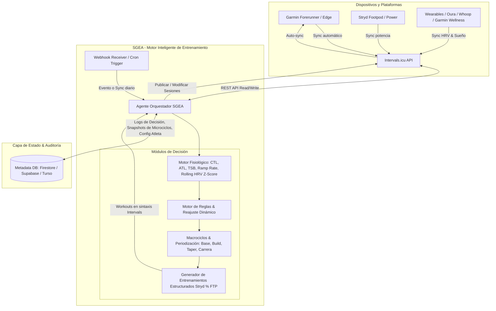
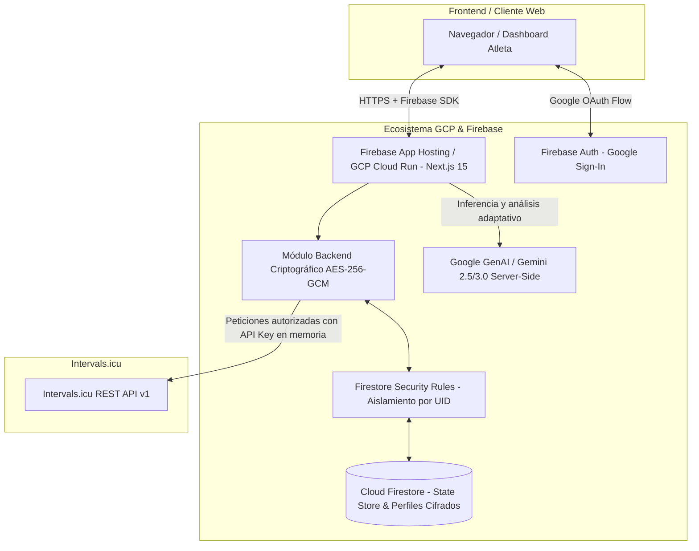
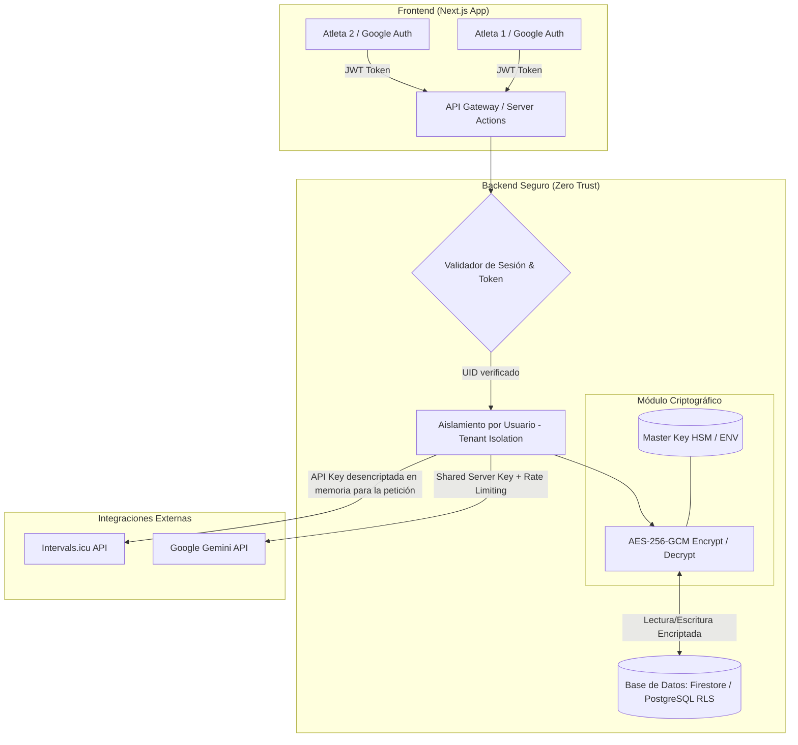
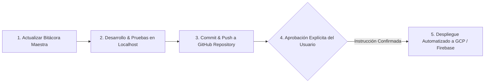

# 📋 Bitácora Maestra: Sistema Adaptativo de Entrenamiento Inteligente (SGEA)

---

## 1. Visión y Objetivo General
Construir una plataforma autónoma de gestión, periodización dinámica y prescripción adaptativa del entrenamiento deportivo con integración bidireccional al ecosistema de **Intervals.icu**, **Garmin Connect** y potenciómetros **Stryd**.

El sistema actúa como un **Head Coach Fisiológico Digital (Agente Inteligente)** que analiza continuamente el estado del atleta (fatiga acumulada, aptitud física, carga aguda, variabilidad de la frecuencia cardíaca - HRV, calidad del sueño y respuesta cardiovascular), contrastando la carga ejecutada vs. planificada para reconstruir, modular o sustituir microciclos en tiempo real, maximizando la adaptación biológica y minimizando el riesgo de sobreentrenamiento y lesiones osteoarticulares.

---

## 2. Diagrama de Arquitectura y Flujo de Datos



---

## 3. Alcance Funcional del Sistema

### 3.1. Ingesta y Procesamiento de Datos (Intervals.icu API)
- **Métricas de Rendimiento (Banister Impulse-Response Model):**
  - **CTL (Chronic Training Load / Fitness):** Constante de tiempo $\tau_1 \approx 42\text{ días}$.
  - **ATL (Acute Training Load / Fatigue):** Constante de tiempo $\tau_2 \approx 7\text{ días}$.
  - **TSB (Training Stress Balance / Form):** $\text{TSB} = \text{CTL} - \text{ATL}$.
  - **Ramp Rate:** Tasa de incremento de CTL semanal ($\Delta\text{CTL}/\text{semana}$).
- **Biomarcadores de Recuperación y Estado Vegetativo:**
  - **HRV (rMSSD / SDNN):** Cálculo de *Rolling Baseline* de 7 a 30 días y cálculo de desviación estándar ($Z\text{-Score}$).
  - **RHR (Resting Heart Rate):** Frecuencia cardíaca en reposo matutina.
  - **Métricas subjetivas de Wellness:** Sueño, fatiga percibida, estrés, dolor muscular (DOMS).
- **Control de Adherencia y Asimilación:**
  - Comparativa de TSS / rTSS planificado vs. ejecutado.
  - Tiempo en zonas de potencia (Stryd CP/FTP) y zonas de FC (Karpovich / Coggan).

---

## 4. Matriz Semanal de Disponibilidad & Disciplinas

| Día | Disciplina Base | Enfoque Principal | Dispositivo / Métrica Primaria |
| :--- | :--- | :--- | :--- |
| **Lunes** | 💤 **Descanso Total** | Recuperación pasiva / Balance neurovegetativo | N/A |
| **Martes** | 🏃 **Carrera (Run)** | Calidad / Umbral / Intervalos VO2max | Garmin Forerunner + Stryd (% CP / FTP) |
| **Miércoles** | 🚴 **Ciclismo (Ride)** | Base Aeróbica Z2 / Trabajo cruzado sin impacto | Garmin Edge (% Bike FTP) |
| **Jueves** | 🏋️ **Fuerza (Gym)** | Pliometría, fuerza reactiva, cadena posterior y sóleo | Rutina estructurada (`WeightTraining`) |
| **Viernes** | 🏃 **Carrera (Run)** | Rodaje Regenerativo / Descarga activa (Z1-Z2) | Garmin Forerunner + Stryd (% CP / FTP) |
| **Sábado** | 🚴 **Ciclismo (Ride)** | Fondo de Resistencia Outdoor / Estímulo metabólico | Garmin Edge (% Bike FTP) |
| **Domingo** | 🏃 **Carrera (Run)** | Fondo Largo / Tirada progresiva con bloques a ritmo objetivo | Garmin Forerunner + Stryd (% CP / FTP) |

---

## 5. Tipologías de Macrociclos Soportados

```
Fases del Macrociclo:
[ FASE BASE (GPP) ] ──> [ FASE CONSTRUCCIÓN (SPP) ] ──> [ FASE ESPECÍFICA / PICO ] ──> [ TAPER & RACE ]
```

### A. Ciclo de Mantenimiento
- **Objetivo:** Preservar la capacidad mitocondrial, umbrales aeróbicos y masa muscular sin acumular fatiga crónica ni estrés articular.
- **Límites Fisiológicos:** TSB en zona neutra ($-5 \le \text{TSB} \le +5$). Ramp Rate semanal $\approx 0$ a $+2$.
- **Distribución:** Volumen moderado, 1 estímulo de calidad corto a la semana, énfasis en trabajo cruzado (ciclismo) y fuerza preventiva.

### B. Ciclo de Construcción (Build Phase)
- **Objetivo:** Incrementar la potencia crítica (Stryd CP / FTP), la capacidad glucolítica y la tolerancia al lactato.
- **Límites Fisiológicos:** Ramp Rate semanal entre $+5$ y $+8$ puntos de CTL. TSB oscilando entre $-10$ y $-25$.
- **Distribución:** Sobrecarga progresiva (bloques 3:1 o 2:1 con semana de descarga), microciclos con 2 sesiones de calidad (martes + bloques en tirada dominical).

### C. Ciclo Específico de Maratón
- **Objetivo:** Maximizar la economía de carrera (kJ/km), durabilidad muscular, capacidad de oxidación de grasas y ritmo específico maratón ($88\text{--}92\%$ Stryd CP).
- **Prioridad:** Carrera a pie > Fuerza funcional/pliometría > Ciclismo como regenerador no impactante.
- **Distribución:** Tiradas dominicales de hasta 28–34 km con segmentos a potencia objetivo de competición.

### D. Ciclo de Triatlón (Sprint / Olímpico / 70.3)
- **Objetivo:** Periodización concurrente multi-deporte (Natación, Ciclismo, Carrera) minimizando la interferencia neuromuscular.
- **Prioridad:** Distribución de densidad de carga segmentada por impacto articular.

---

## 6. Reglas Fisiológicas del Motor de Reajuste

| Condición Detectada | Umbral / Criterio | Acción del Agente SGEA |
| :--- | :--- | :--- |
| 🚨 **Fatiga Extrema / Riesgo Lesión** | $\text{TSB} < -25$ o HRV $Z\text{-Score} < -1.5$ continuo $\ge 2$ días | Convierte la sesión de calidad o fondo en rodaje regenerativo (Z1) o descanso total. Reduce el TSS semanal total un $30\%$. |
| ⚠️ **Ramp Rate Excesivo** | $\Delta\text{CTL} > +8\text{ pts/semana}$ | Congela el incremento de volumen del microciclo siguiente y reprograma la semana con meseta de consolidación. |
| 🟢 **Adaptación Óptima** | $-10 \le \text{TSB} \le +5$ y HRV estable | Mantiene la progresión nominal del plan del macrociclo activo. |
| 🔄 **Asimilación Incompleta / Sesión Saltada** | Sesión clave ejecutada con $\text{TSS} < 60\%$ del programado | Redistribuye el estímulo clave en la semana sin acumular dos sesiones de calidad en días consecutivos ni comprometer el descanso. |
| 📈 **Supercompensación / Taper** | Últimas 2-3 semanas previas a competición | Reducción de volumen del $40\text{--}60\%$ manteniendo la intensidad específica (frecuencia e intervalos cortos a ritmo de carrera). |

---

## 7. Modalidad de Ejecución & Arquitectura Simplificada

El sistema está diseñado para operar en **Modo Manual / Bajo Demanda (On-Demand)**, otorgándote control total sobre cuándo el agente evalúa tu estado y cuándo actualiza tu calendario.

### ¿Se requiere Cloud Scheduler o automatización en la nube?
**No, no es necesario.** Al operar de forma manual:
1. **Control Total del Atleta:** Tú decides cuándo disparar el análisis (por ejemplo, por la mañana tras sincronizar tu reloj/Stryd o antes de planificar tu microciclo).
2. **Cero Complejidad de Infraestructura:** No necesitas configurar ni mantener Cloud Scheduler, colas ni crons en la nube.
3. **Múltiples Formas de Ejecución Manual:**
   - **CLI / Terminal:** Un simple comando (`npm start evaluate` o `python main.py --sync-week`).
   - **API / Webhook / Endpoint Local o Cloud Run:** Un botón simple en una interfaz web o una petición HTTP (`POST /api/evaluate-microcycle`).
   - **Interactivo con el Agente:** Solicitarle directamente al asistente *"Analiza mi fatiga de hoy y ajusta el microciclo"*.

---

## 8. Infraestructura Oficial: Ecosistema GCP & Firebase

Se adopta oficialmente el ecosistema integrado de **Google Cloud Platform (GCP) + Firebase** por su seguridad nativa, compatibilidad con la capa gratuita (*Always Free*) e integración de alto rendimiento:



| Componente | Tecnología | Rol en la Plataforma | Capa Gratuita / Costo |
| :--- | :--- | :--- | :--- |
| **Frontend & Backend API** | **Next.js 15 en Firebase App Hosting / GCP Cloud Run** | Renderizado del dashboard, Server Actions y endpoints seguros. | 2 millones de peticiones/mes gratis ($0/mes). |
| **Autenticación** | **Firebase Authentication (Google Provider)** | Inicio de sesión seguro con Google OAuth y control de acceso. | Ilimitado / Gratuito. |
| **Base de Datos / Estado** | **Cloud Firestore (Modo Nativo)** | Almacén de perfiles, parámetros de macrociclos, logs y credenciales cifradas. | 1 GB de almacenamiento, 50k lecturas y 20k escrituras/día ($0/mes). |
| **Seguridad de Datos** | **Firestore Security Rules + AES-256-GCM** | Aislamiento estricto por `request.auth.uid` y cifrado en reposo. | Integrado sin coste adicional. |
| **Inteligencia Fisiológica** | **Google Gemini API / Vertex AI** | Análisis cualitativo, árbol de razonamiento y reajustes. | Cuota gratuita mensual / Pay-as-you-go ultra económico. |

> ### 💡 Ventaja Estratégica:
> Todo el backend, base de datos, seguridad y modelos de IA residen dentro de una misma infraestructura Google unificada, permitiendo crear un nuevo proyecto en GCP (ej. `sgea-training`) manteniendo costo $0.00/mes y cero interferencia con otros proyectos existentes.


---

## 9. Análisis: ¿Es Necesaria una Base de Datos si Intervals.icu almacena todo?

### Lo que Intervals.icu **SÍ** almacena:
- Calendario completo de eventos y entrenamientos (pasados y futuros).
- Telemetría de sesiones (potencia Stryd segundo a segundo, FC, cadencia, altimetría).
- Métricas Banister calculadas (CTL, ATL, TSB, Ramp Rate, EF, Decoupling cardíaco).
- Historial de Wellness (HRV, sueño, peso, fatiga, pulsaciones en reposo).
- Configuración del atleta (FTP de carrera, FTP de ciclismo, zonas de FC y potencia).

### Lo que Intervals.icu **NO** almacena (y por qué SÍ se requiere una base de datos ligera):
1. **Historial de Decisiones y Auditoría del Agente (Reasoning Logs):**
   - Registrar *por qué* el agente cambió una sesión (ej. *"Modificada tirada del domingo de 28km a 18km porque HRV Z-score cayó a -2.1 el sábado tras sesión de ciclismo"*).
2. **Idempotencia y Caché de Solicitudes:**
   - Evitar llamadas redundantes a la API de Intervals y acelerar la carga del Dashboard.
3. **Parámetros del Macrociclo y Reglas Personalizadas del Atleta:**
   - Fecha de la carrera objetivo, estrategia de tapering elegida, preferencias de días fijos de disponibilidad, restricciones por lesiones pasadas.
4. **Snapshots de Microciclos (Versionado / Rollback):**
   - Capacidad de revertir la semana si el atleta desea volver a la propuesta original anterior al reajuste adaptativo.

> ### 💡 Veredicto de Persistencia:
> **Intervals.icu es la ÚNICA fuente de verdad para entrenamientos y telemetría**.
> Se utiliza una **base de datos ultraligera y serverless (Google Cloud Firestore o Supabase / Turso SQLite local)** únicamente como **State Store del Agente** (configuraciones, logs de inferencia, tokens y estado de ejecución).

---

## 10. Arquitectura Multiusuario & Políticas de Seguridad Estricta

Para soportar múltiples atletas de forma completamente aislada, escalable y con máxima seguridad de datos:



### 10.1. Principios de Seguridad & Aislamiento (Zero-Leakage)
1. **Autenticación Federada con Google (OAuth 2.0 / Firebase Auth):**
   - Cada usuario se identifica unívocamente por su `uid`.
   - Control de acceso configurable: Modo Abierto (cualquier atleta con cuenta Google) o Modo Restringido (Lista blanca de correos autorizados por el Administrador).
2. **Encriptación de Claves de Intervals en Reposo (AES-256-GCM):**
   - La API Key de Intervals.icu de cada usuario se introduce en su pantalla de perfil privado.
   - **Nunca se almacena en texto plano en la base de datos.** Se encripta con un algoritmo `AES-256-GCM` utilizando un vector de inicialización único (IV) y un Tag de autenticación.
   - Solo se desencripta en la memoria volátil del backend en el instante preciso en que el usuario solicita una sincronización.
3. **Aislamiento Estricto de Datos (Row-Level Security & Tenant Isolation):**
   - Las consultas a la base de datos están forzadas por el `uid` del usuario autenticado. Ningún usuario puede ver, modificar ni invocar peticiones con las credenciales o planes de otro atleta.
4. **Protección y Rate Limiting de la API Key de Gemini:**
   - La clave de Gemini reside exclusivamente en el servidor central.
   - Se implementa un limitador de tasa de peticiones (Rate Limiter) por usuario para prevenir abusos o consumos imprevistos de cuota.

---

## 11. Entorno Gráfico & Experiencia de Usuario Multiusuario (Frontend UI/UX)

1. **Gestión de Perfil & Conexiones:**
   - Formulario de configuración de credenciales de Intervals (`Athlete ID`, `API Key`) con validación de conexión en tiempo real (*"Probar conexión con Intervals.icu"*).
   - Configuración individual de potencia crítica (Stryd CP / Run FTP, Bike FTP), peso, zonas y objetivo de temporada.
2. **Panel Fisiológico Integral (Head Coach Dashboard):**
   - Métricas en tiempo real del atleta activo: **CTL (Fitness)**, **ATL (Fatiga)**, **TSB (Forma)**, **Ramp Rate** y **HRV Rolling Z-Score**.
   - Indicador visual del estado de recuperación: 🟢 Óptimo, ⚠️ Precaución, 🚨 Fatiga Extrema / Sobrecarga.
3. **Planificador Semanal Interactivo (Microciclo Adaptativo):**
   - **Fechas Reales y Navegación de Semanas:** Visualización de fechas ISO (`YYYY-MM-DD`) y formato legible (`18 Ago`), con selector de "Esta Semana", "Próxima Semana" y desplazamiento temporal continuo.
   - **Control Interactivo de Descanso:** Conmutador/checkbox por día (`"💤 En Descanso"`) que permite modular la carga o transformar cualquier sesión en descanso pasivo.
   - **Reordenamiento Dinámico (Swap Sessions):** Selector para intercambiar sesiones entre días con 1 clic (ej. mover series de calidad o tirada larga).
   - **Validador Fisiológico en Tiempo Real:** Alerta preventiva ante sesiones de carrera de alto impacto en días consecutivos.
   - **Inspector de Sintaxis Stryd (% FTP):** Visualizador de bloques estructurados de entrenamiento que se envían directamente a Intervals.icu.
4. **Centro de Mando del Agente Inteligente:**
   - Botón manual de acción: **"Reevaluar y Ajustar Microciclo"**.
   - Visualización del **Árbol de Razonamiento del Agente**: Explicación clara de por qué se sugiere cada cambio antes de sincronizarlo.
   - Botón de aprobación y sincronización directa: **"Sincronizar a Intervals.icu"** con fechas exactas del calendario.

---

## 12. Dossier Técnico Completo: Intervals.icu API & Integración con Stryd / Garmin

### 12.1. Credenciales y Configuración de Conexión
- **URL Base de la API:** `https://intervals.icu/api/v1`
- **Método de Autenticación:** HTTP Basic Auth
  - **Usuario:** `API_KEY`
  - **Contraseña:** Clave API del Atleta
  - **Cabecera HTTP:** `Authorization: Basic <base64("API_KEY:" + userApiKey)>`
- **Dispositivos Vinculados:** Garmin Forerunner / Edge + Sensor de Potencia Stryd (Running Power).

### 12.2. Mapa de Endpoints Principales (REST API v1)

| Recurso | Método | Endpoint | Parámetros / Propósito |
| :--- | :--- | :--- | :--- |
| **Resumen del Atleta** | `GET` | `/api/v1/athlete/{id}` | Perfil general, umbrales y cargas actuales (`ctl`, `atl`, `tsb`, zonas de potencia/ritmo). |
| **Métricas de Bienestar (Wellness)** | `GET` | `/api/v1/athlete/{id}/wellness` | `oldest=YYYY-MM-DD&newest=YYYY-MM-DD`<br>Series temporales: `rampRate`, `restingHR`, `ctlLoad`, `atlLoad`, `hrv`, `sleepQuality`, `soreness`. |
| **Calendario / Eventos** | `GET` | `/api/v1/athlete/{id}/events` | `oldest=YYYY-MM-DD&newest=YYYY-MM-DD`<br>Lista de entrenamientos programados (`category="WORKOUT"`). |
| **Crear Entrenamiento** | `POST` | `/api/v1/athlete/{id}/events` | Inserta una nueva sesión estructurada en el calendario del atleta. |
| **Eliminar Entrenamiento** | `DELETE` | `/api/v1/athlete/{id}/events/{event_id}` | Borra una sesión existente para reemplazo y reajuste dinámico. |
| **Actividades Realizadas** | `GET` | `/api/v1/athlete/{id}/activities` | `oldest=YYYY-MM-DD&newest=YYYY-MM-DD`<br>Lectura de telemetría de archivos `.FIT`, TSS real ejecutado, vatios medios y FC. |

### 12.3. Métricas Fisiológicas y Variables del PMC (Performance Management Chart)

| Métrica | Campo en API | Endpoint | Definición & Rangos de Interpretación |
| :--- | :--- | :--- | :--- |
| **Aptitud (Fitness)** | `ctl` | `/athlete/{id}` o `/wellness` | Chronic Training Load (media móvil ponderada con $\tau = 42\text{ días}$). |
| **Fatiga (Fatigue)** | `atl` | `/athlete/{id}` o `/wellness` | Acute Training Load (media móvil exponencial con $\tau = 7\text{ días}$). |
| **Forma (Form / TSB)** | `tsb` | Calculado (`ctl - atl`) | • **$+5$ a $+20$**: Óptimo para competir / Supercompensación (Taper).<br>• **$-10$ a $+5$**: Neutro / Adaptación positiva en curso.<br>• **$< -20$**: Sobrecarga alta / Riesgo elevado de lesión o sobreentrenamiento. |
| **Tasa de Rampa (Ramp Rate)** | `rampRate` | `/wellness` | Incremento de CTL semanal ($\Delta\text{CTL}/\text{sem}$).<br>• **$+3$ a $+7$/sem**: Progresión óptima.<br>• **$> +8$/sem**: Peligro de sobrecarga rápida. |
| **FC en Reposo** | `restingHR` | `/wellness` | Indicador de recuperación cardiovascular y balance autonómico matutino. |

### 12.4. Reglas Estrictas de Sintaxis para Entrenamientos Estructurados (WORKOUT)

> [!CAUTION]
> **Prevención de Errores de Duración:**
> Para evitar errores de cálculo de tiempo gigante en la API (como sesiones calculadas de 80h o 100h) y garantizar total compatibilidad con los dispositivos Garmin y sensores Stryd, se deben respetar estrictamente las siguientes reglas:

#### A. Carrera por Potencia Stryd (Tiempo + % FTP / CP)
> **Regla de Oro:** Se define siempre la duración en tiempo (`m` o `s`), la intensidad en `% FTP` (Potencia Crítica) y los bloques de repetición con `Nx` (ej. `4x`).

```plaintext
Warmup
- 15m 70% FTP

4x
- 8m 100% FTP
- 3m 65% FTP

Cooldown
- 10m 60% FTP
```

#### B. Carrera por Distancia (Metros / Km + % Pace)
> **Regla de Oro:** Si se especifica distancia (`mtr` o `km`), la intensidad debe ser obligatoriamente en `% Pace` (nunca `% FTP`).

```plaintext
Warmup
- 15m 65% Pace

5x
- 1000mtr 100% Pace
- 2m 60% Pace

Cooldown
- 10m 60% Pace
```

#### C. Ciclismo (Tiempo + % FTP)

```plaintext
Warmup
- 15m 50% FTP

Main
- 1h30m 65% FTP

Cooldown
- 15m 50% FTP
```

#### D. Fuerza / Gimnasio (`WeightTraining`)
> **Regla de Oro:** Texto plano estructurado con series y repeticiones sin asignación de zonas de potencia.

---

## 13. Gobernanza del Proyecto, Ciclo de Vida y Políticas de Despliegue

Para mantener el orden, estabilidad y trazabilidad estricta del proyecto SGEA:



### 13.1. Reglas Mandatorias de Gobernanza:
1. **Actualización Obligatoria de la Bitácora Maestra:**
   - Antes o inmediatamente después de cada mejora, refactorización, cambio de arquitectura o nuevo requerimiento, **es obligatorio actualizar la [Bitácora Maestra](file:///Users/germanmorales/Documents/antigravity/IA%20Training/BITACORA_MAESTRA.md)**.
   - Ningún cambio de código debe existir sin su correspondiente justificación técnica y registro en este documento.
2. **Entorno de Desarrollo y Validación Local (`localhost`):**
   - Todas las nuevas funcionalidades, interfaces gráficas y conexiones de API deben desplegarse y verificarse exhaustivamente primero en el entorno local (`localhost:3000`).
3. **Control de Versiones en GitHub:**
   - **Repositorio Oficial:** [https://github.com/GEME80/Training-IA](https://github.com/GEME80/Training-IA)
   - Inicialización con `.gitignore` exhaustivo (Next.js, Node, Firebase credentials y `.env*.local`).
   - Cada ciclo de trabajo completado se confirmará mediante *commits* descriptivos y *pushes* a la rama principal (`main`).
4. **Aprovisionamiento y Despliegue en GCP / Firebase:**
   - **Proyecto Oficial GCP / Firebase:** `training-ia-8f67f` ([Consola Firebase](https://console.firebase.google.com/u/0/project/training-ia-8f67f/overview))
   - **Firebase Web App:** `sgea-web` (`1:518084993984:web:90479d02bb3884e6cdde25`).
   - **Cloud Firestore (Modo Nativo):** Base de datos `(default)` creada y reglas `firestore.rules` con aislamiento por UID desplegadas.
   - **Criptografía:** Módulo `AES-256-GCM` activo con llave maestra generada en `.env.local`.
   - **Cero Despliegues Automáticos no Autorizados:** El despliegue a la infraestructura en la nube de Google Cloud Platform (GCP / Firebase) **únicamente se ejecutará bajo la instrucción explícita del usuario** mediante Firebase App Hosting o Cloud Run.

---

## 14. Registro Histórico de Versiones y Evolución del Sistema (Changelog Técnico)

### 🚀 Versión 0.5.0 (Agosto 2026) — Arquitectura UX/UI por Vistas, Motor de Plantillas Progresivas de 16 Semanas y Periodización 3:1

#### 1. Rediseño de Experiencia de Usuario e Información (UX/UI):
- **Barra de Navegación por Pestañas (`NavigationTabs.tsx`):**
  - **`🗺️ 1. Plan del Macrociclo (Master Plan)`**: Vista macro de la temporada, cronograma de las 16 semanas del ciclo, conteo regresivo a la carrera objetivo y visualización detallada de la plantilla diaria de cualquier semana seleccionada.
  - **`🧠 2. Microciclo Activo & IA (Esta Semana / Próxima)`**: Panel de control del Head Coach Digital, telemetría Banister en tiempo real (CTL, ATL, TSB, HRV), diagnóstico adaptativo y plan semanal editable con botón único de sincronización a Intervals.icu.
  - **`⚙️ 3. Configuración & Atleta`**: Panel centralizado para parámetros de potencia (Stryd CP / Bike FTP), Matriz Semanal de Disponibilidad (Lunes a Domingo), Gestión de Carreras Objetivo y clave Gemini API.

#### 2. Motor de Plantillas Progresivas de Macrociclo (`macrocycleTemplates.ts`):
- Eliminación total de microciclos planos o idénticos. Cada una de las 16 semanas cuenta con una plantilla cuantitativa calculada a la potencia del atleta:
  - **Base I & II (Sem 1-4):** Cuestas cortas de neuro-fuerza (`6x 45s @ 96% CP`), rodajes con strides reactivos (`5x 20s @ 110% CP`), tempo aeróbico Z3 (`2x 10m @ 86% CP`) y semana 4 de descarga biológica 3:1 (`55m Z2 suave`).
  - **Construcción / Build I & II (Sem 5-10):** Series de Umbral Lactato Z4 (`4x 6m` a `4x 8m @ 100% CP`), sweetspot en ciclismo (`3x 8m @ 85% FTP`), tiradas dominicales de `85m a 95m` con bloques a ritmo maratón y descarga programada en semana 8.
  - **Pico de Rendimiento / Peak (Sem 11-13):** Fondos específicos de Maratón de **`1h45m a 1h55m (28-32km)`** con bloques a potencia de carrera (`3x 5km @ 80% CP`), series de potencia crítica (`5x 4m @ 102% CP`) y descarga intermedia en semana 12.
  - **Tapering (Sem 14-15):** Descarga de volumen al -50% con toques breves de ritmo (`3x 2m @ 82% CP`).
  - **Semana de Competición (Sem 16):** Activación previa de 25m y ejecución de 42.195 km a potencia constante de maratón.

#### 3. Flujo de Mantenimiento Pre-Competición & Cálculo de Fecha de Inicio:
- Detección automática del inicio del bloque de 16 semanas para cualquier maratón objetivo.
- Prescripción de microciclos de mantenimiento adaptativo (tiradas de 55m máx, 280-360 TSS) durante todas las semanas previas a la fecha de inicio del ciclo específico.

#### 4. Sincronización Segura y Sobrescritura Limpia en Intervals.icu:
- Consulta del rango de fechas del microciclo y eliminación previa de sesiones antiguas marcadas con `[SGEA]` antes de insertar el nuevo plan, evitando duplicidades de calendario o inflado de TSS.

---

### 🚀 Versión 0.6.0 (Agosto 2026) — Biblioteca Integral de Macrociclos, Configurador Dinámico con Calendario & Previsualizador Interactivo

#### 1. Biblioteca Modular de Macrociclos (`macrocycleLibrary.ts`):
- **Catálogo por Tipo de Carrera (Event-Driven):**
  - **Maratón (42.195 km):** 12 a 24 semanas. Economía de carrera, oxidación lipídica, fondos de hasta 34 km y bloques a $80\text{--}84\%$ Stryd CP.
  - **Media Maratón (21.097 km):** 10 a 18 semanas. Potencia de crucero en umbral lactato Z4 ($93\text{--}97\%$ CP) y tiradas progresivas de hasta 22 km.
  - **10K Ruta / Pista:** 8 a 16 semanas. Potencia aeróbica máxima ($VO_2\text{max}$ Z5), intervalos de 1000m a $102\text{--}106\%$ CP y tolerancia a hiperacidez.
  - **5K Velocidad & Potencia Crítica:** 6 a 12 semanas. Zancada neuromuscular, reclutamiento de fibras rápidas tipo IIa y series cortas al $108\text{--}112\%$ CP.
  - **Gran Fondo Ciclismo:** 8 a 18 semanas. Resistencia muscular sobre la bicicleta, densidad en Sweetspot ($85\text{--}92\%$ Bike FTP) y fondos de 3 a 5 horas.
  - **Triatlón Media Distancia (70.3):** 12 a 20 semanas. Carga concurrente multi-disciplina sin interferencia neuromuscular y transiciones *Brick*.
- **Catálogo por Momento / Estado del Atleta (Athlete Moment):**
  - **Mantenimiento Adaptativo & Salud Articular:** 4 a 16 semanas. TSB neutro ($-5 \le \text{TSB} \le +5$), prevención de sóleo/Aquiles y tiradas de $\le 55\text{ min}$.
  - **Construcción de Base Pura (GPP / Base Building):** 6 a 14 semanas. Capilarización periférica, volumen polarizado en Z2 y neurofuerza en cuestas.
  - **Recuperación Post-Competición (Deload):** 2 a 6 semanas. Reparación miofibrilar, estabilización del HRV y cero impacto articular inicial.
  - **Retorno Progresivo / Reacondicionamiento:** 4 a 12 semanas. Protocolo CaCo (Caminar-Correr) con progresión mecánica inferior al $10\%$ semanal.

#### 2. Configurador de Temporada con Calendario & Periodización Proporcional (`macrocycleGenerator.ts`):
- Selección interactiva de **Fecha de Inicio (Lunes)** y **Fecha Fin / Competición**, o selector continuo de semanas.
- Algoritmo de distribución proporcional de fases (Base, Construcción, Pico y Tapering) adaptado a la distancia y duración elegida.
- Inserción automática de semanas de descarga y asimilación biológica bajo la **Regla 3:1** (semanas 4, 8, 12, etc.).

#### 3. Previsualizador Fase por Fase (*Preview Before Commit* - `MacrocyclePreviewTimeline.tsx`):
- Timeline gráfico interactivo con curvas de TSS, alturas de barra proporcionales y codificación por color según tipo de microciclo (Carga, Choque, Descarga, Competición).
- Visor desplegable de los **7 días de entrenamiento estructurado** para cualquier semana del macrociclo seleccionado, con cálculo en vatios a partir del Stryd CP y Bike FTP reales del atleta antes de guardar.

#### 4. Integración y Activación Inmediata (`MacrocycleLibraryModal.tsx` & `page.tsx`):
- Botón *"📚 Biblioteca de Macrociclos"* integrado en el panel principal.
- Persistencia en almacenamiento local y recálculo automático del estado del atleta, integrándose con el Head Coach IA para saltar directamente a cualquier microciclo.

---

### 🚀 Versión 0.7.0 (Agosto 2026) — Asistente Guiado Paso a Paso (Wizard), Detección de Puente Pre-Temporada (Tokio 2027), Persistencia en Firestore y Personalización con IA

#### 1. Asistente Guiado Paso a Paso (`MacrocycleWizardModal.tsx` & `macrocycleWizard.ts`):
- Eliminación del selector de opciones estáticas en favor de un **Wizard interactivo por etapas**:
  - **Paso 1:** Selección de enfoque (Competición vs. Momento del Atleta).
  - **Paso 2:** Configuración de carrera (ej. *Maratón de Tokio 2027*, 7 de marzo de 2027) o momento.
  - **Paso 3:** Detección de línea temporal y **Puente de Mantenimiento Pre-Competición**: cálculo del kickoff de 16 semanas (ej. 16 de Noviembre de 2026) y estructuración de las semanas previas en Mantenimiento Adaptativo & Salud Articular.
  - **Paso 4:** Diagnóstico fisiológico en vivo con métricas de Intervals.icu (CTL, ATL, TSB, Stryd CP, Bike FTP).
  - **Paso 5:** Generación y personalización con IA de Gemini más previsualización y guardado.

#### 2. Persistencia en Cloud Firestore & Cero Hardcoding (`src/lib/db/macrocycles.ts` & `/api/macrocycles`):
- Persistencia completa de macrociclos generados en la subcolección `users/{uid}/macrocycles/{macrocycleId}` y puntero activo en `users/{uid}/meta/active_macrocycle`.
- Endpoints REST para lectura y escritura segura en la base de datos de Google Cloud Firestore.

#### 3. Motor de Periodización con IA (`src/lib/gemini/macrocycleAI.ts` & `/api/macrocycles/generate-ai`):
- Inferencia server-side que cruza la telemetría viva de Intervals.icu con el objetivo del atleta para modular la rampa de sobrecarga ($+4$ a $+6$ CTL/sem), semanas de descarga 3:1 y metas de vatios en Stryd y Ciclismo.

#### 4. Rediseño Minimalista de Interfaz (`MacrocycleView.tsx`):
- Consolidación en una única cabecera elegante sin cajas ni botones duplicados.
- Gráficas de bloques e intervalos escalonados integradas en cada tarjeta diaria con botón amigable *`📋 Detalle del Plan`*.


