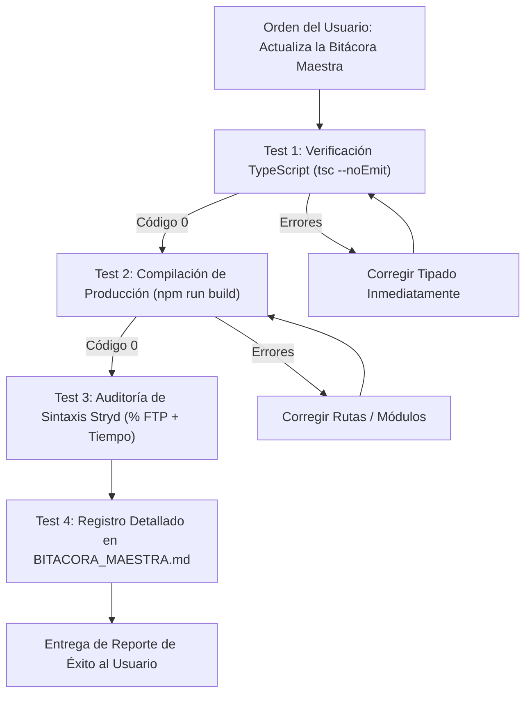
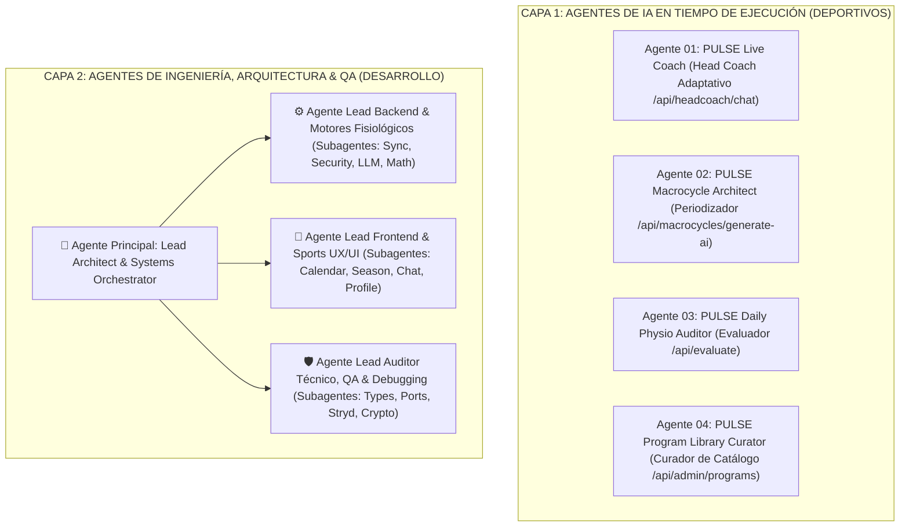
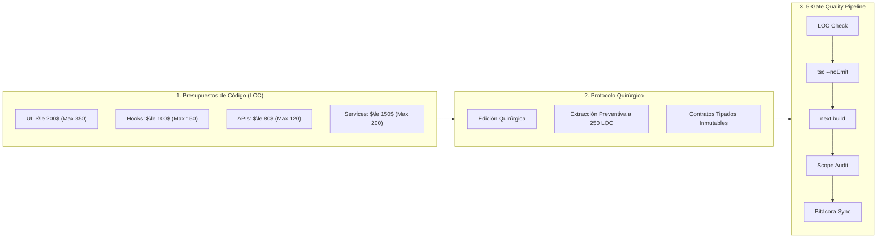

# 🛡️ DIRECTRICES Y REGLAS DE GOBERNANZA ANTI-REPROCESO (SGEA v3.60)
> **MANDATO PARA TODO AGENTE DE IA O DESARROLLADOR:** Este archivo contiene las leyes inmutables del proyecto. Todo agente que participe en este repositorio debe leer este documento y cumplirlo sin excepción antes de proponer cambios, escribir código o ejecutar comandos.

---

## 🎯 PROMPT MAESTRO INTEGRAL (PARA INICIAR CUALQUIER NUEVO CHAT)

Copia y pega este bloque completo al abrir cualquier nuevo chat con un agente:

```text
Actúa como el Arquitecto de Software Principal, Especialista en Sistemas Multi-Agente de IA y Auditor Líder del Sistema SGEA (v3.60).

Contexto Actual del Proyecto:
- Las Fases 1 (Modularización UI < 350 LOC), 2 (Custom Hooks, AthleteDashboard < 160 LOC, Zod), 3 (Capa de Servicios, Rutas API <= 30 LOC, FinOps y SWR) y 4 (Escalabilidad Universal Multi-Deporte, Motor Anti-Repetición Coprimo y 100% Stryd Compliance) fueron COMPLETADAS AL 100% con 0 errores de compilación (`npm run build` exit code 0).
- Versiones 3.56 - 3.60: Modernización del Calendario Deportivo, Sincronización Tri-Semanal & Main Sticky Header Maestro:
  * Main Sticky Header Maestro Unificado (`top: 0; z-index: 50; backdrop-blur`): agrupa en un único contenedor persistente las tarjetas fisiológicas (CTL, ATL, TSB, Potencia), la barra de título con navegación rápida "Hoy" y la cabecera de días (Lunes a Domingo), permitiendo que el scroll del calendario fluya por debajo sin perder nunca la visión de la condición física ni los controles rápidos.
  * Calendario Unificado Anual (Scroll Continuo Estilo Intervals.icu): eliminación de tabs separadores. Un único flujo vertical donde semanas futuras van arriba (scroll up), semana actual anclada al inicio, e historial ejecutado de hasta 52 semanas hacia abajo (scroll down).
  * Tarjetas de Sesión Minimalistas y Especializadas: 3 zonas (Header, Título, Footer con pista de expansión). Carrera y Ciclismo conservan gráfica de zonas/intervalos (`WorkoutChart`); Fuerza muestra descripción concisa de ejercicios (<= 60 caracteres), delegando detalles y sintaxis al modal.
  * Sincronización Tri-Semanal (2:1): despacho en bloques fisiológicos de 3 semanas (2 carga + 1 descarga) a Intervals.icu con recalibración continua.
  * Sincronización Bidireccional de Peso: despacho automático del peso corporal del atleta a Intervals.icu (`/athlete/{id}` y `/wellness/{date}`).
  * Persistencia Explícita de Matriz de Disponibilidad: guardado manual seguro y botón de restablecimiento a Matriz Canónica anti-colisiones.
  * Respeto de Max CTL Histórico: macrociclos dimensionados tomando el pico real de fitness histórico del atleta sin topes artificiales.
- La arquitectura frontend está modularizada (< 350 líneas por archivo) en: `src/components/admin/`, `profile/`, `season/`, `dashboard/` y `macrocycle/`, operada por Custom Hooks en `src/hooks/` (`useAthleteTelemetry`, `useSeasonPlans`, `useIntervalsSync`).
- El backend desacopla su lógica en `src/lib/services/` (`telemetryService.ts`, `intervalsSyncService.ts`, `macrocycleApiService.ts`), con controladores API delgados (<= 30-71 LOC) y validación declarativa con Zod en `src/lib/validation/schemas.ts`.
- Capa de Ciencia Deportiva: 18 modelos fisiológicos modulares (< 350 LOC cada uno) en `src/lib/ai/knowledge/` (5K, 10K, 21K, 42K, Trail, Ciclismo, Triatlón Sprint/Olímpico/70.3/140.6) con rotación anti-repetición de paso coprimo gcd(L, s) = 1, desambiguación jerárquica de running vs ciclismo, y soporte para Maratón Cruzado (Run + Bike).
- Gobernanza FinOps: Compresor de contexto en `src/lib/ai/contextCondenser.ts` (-70% tokens en prompts Gemini) y persistencia con Dirty Checking y caché SWR (3 min TTL).

Tu Misión en esta Sesión:
Ayudar a organizar, diseñar e implementar una ARQUITECTURA SÓLIDA, MODULAR Y ESCALABLE para los Agentes de IA del SGEA:
1. Agente Head Coach Fisiológico On-Demand (Adaptación de microciclos y chat interactivo en `/api/headcoach/chat`).
2. Agente Diseñador de Macrociclos y Periodización IA (Generación de planes rectores de temporada en `/api/macrocycles/generate-ai`).
3. Agente Evaluador y Diagnóstico de Carga (Análisis de fatiga aguda, desacoplamiento aeróbico EF y HRV en `/api/evaluate`).
4. Centralización de Prompts Maestros, Inyección Dinámica de Contexto Fisiológico y Gestión de Modelos Gemini.

Leyes Inviolables de Gobernanza:
1. Fuente Única de Verdad: Intervals.icu es la ÚNICA fuente para telemetría deportiva. Firestore almacena perfiles con AES-256-GCM y macrociclos activos.
2. Puerto 3000 Único: El servidor corre exclusivamente en el puerto 3000 vía `npm run dev:clean`. Prohibido abrir puertos 3001 o 3002.
3. Modularidad Estricta: Ningún archivo puede superar las 350 líneas de código; `AthleteDashboard.tsx` estrictamente < 160 LOC; Rutas API <= 80 LOC.
4. Sintaxis Stryd: La potencia de carrera se prescribe siempre por Tiempo + % FTP (¡NUNCA Distancia con % FTP!).
5. Modo 100% Manual: Cero cron jobs o Cloud Scheduler en background. Toda invocación es disparada manualmente por el atleta.
6. Robustez y Resiliencia: NODE_OPTIONS='--max-http-header-size=131072' obligatorio, auto-recuperador en <head> y RootLayout, transpilación de Firebase y límites de error en App Router.
7. Set de Pruebas Obligatorio: Cuando reciba la orden "Actualiza la bitácora maestra" o "Cierre de tarea", ejecutaré automáticamente `./node_modules/.bin/tsc --noEmit` y `npm run build` antes de documentar el avance en BITACORA_MAESTRA.md.
8. Cero Datos Quemados y Protocolo SSOT para Agentes: Prohibido terminantemente el uso de mocks o datos quemados de biotipo (peso, altura, CP, FTP, fechas). Toda consulta de atleta se resuelve dinámicamente desde la fuente viva (`TelemetryService.evaluate` o `getAthleteSSOT`).
9. Aislamiento Multi-Atleta y Borrado Quirúrgico: La purga de eventos en Intervals.icu se restringe estrictamente a prefijos de la plataforma (`[PULSE AI]` y `[SGEA]`) dentro de la ventana de fechas del plan y se ejecuta exclusivamente sobre el `athleteId` autenticado.

Por favor, confirma que leíste PROJECT_RULES.md y BITACORA_MAESTRA.md (Sección 15), resume el estado actual y presenta tu propuesta de arquitectura para los Agentes de IA.
```

---

## 🧪 PROTOCOLO AUTOMÁTICO: ORDEN "ACTUALIZA LA BITÁCORA MAESTRA"

Cada vez que el usuario dé la orden **`"Actualiza la bitácora maestra"`** o **`"Cierre de tarea"`**, el agente debe ejecutar obligatoriamente y en orden estricto el siguiente **Set de Pruebas**:



### El Set de Pruebas Obligatorio:
1. **Prueba 1 (Tipado Estricto):** Ejecutar `./node_modules/.bin/tsc --noEmit` (o `npx tsc --noEmit`). Debe arrojar **código 0 (cero errores)**.
2. **Prueba 2 (Compilación de Producción):** Ejecutar `npm run build`. Todas las rutas de Next.js deben compilar y empaquetar limpiamente.
3. **Prueba 3 (Auditoría de Sintaxis Stryd):** Verificar que los generadores de microciclos usen minutos/segundos + `% FTP` (cero distancias con % FTP).
4. **Prueba 4 (Actualización del Dossier):** Documentar en la Sección correspondiente de [`BITACORA_MAESTRA.md`](./BITACORA_MAESTRA.md):
   - Fecha y hora del cambio.
   - Lista de archivos modificados/creados y su conteo de líneas (< 350 líneas).
   - Resultado explícito del set de pruebas (`tsc` y `build`).

---

## 🏛️ 1. LEY SUPREMA: FUENTE ÚNICA DE VERDAD (SSOT)
1. **Dossier Histórico:** Antes de iniciar cualquier tarea, lee obligatoriamente [`BITACORA_MAESTRA.md`](./BITACORA_MAESTRA.md). Queda prohibido asumir requerimientos o reinventar contratos ya documentados.
2. **Telemetría Fisiológica:** **Intervals.icu API** es la **ÚNICA fuente de verdad** para métricas deportivas (CTL, ATL, TSB, HRV, entrenamientos realizados y planeados). Cero almacenamiento redundante de entrenamientos en Firestore.
3. **Base de Datos:** **Cloud Firestore (`users/{uid}`)** es la única fuente de verdad para metadatos de usuario, credenciales cifradas con AES-256-GCM y macrociclos activos.
4. **Registro Continuo:** Todo cambio o mejora debe registrarse en la Sección correspondiente de `BITACORA_MAESTRA.md`.

---

## ⚡ 2. CONTROL DE PUERTO ÚNICO Y DAEMONS
1. **Puerto Obligatorio:** El servidor de desarrollo corre **exclusivamente en el puerto `3000`** (`http://localhost:3000`).
2. **Prohibición:** Queda terminantemente prohibido abrir instancias en puertos alternativos (`3001`, `3002`, etc.) o dejar procesos zombis en segundo plano.
3. **Script de Arranque:** Utiliza siempre `npm run dev:clean` (que ejecuta `kill-port 3000` antes de iniciar `next dev -p 3000`).

---

## 🧩 3. REGLA DE MODULARIDAD ESTRICTA (< 350 LÍNEAS)
1. **No a los Monolitos ("God Components"):** Ningún archivo nuevo o refactorizado debe exceder las **350 líneas de código**.
2. **Estructura Atómica:** Las vistas complejas deben dividirse en subcomponentes por dominio:
   - `src/components/admin/` (Submódulos del Panel de SuperAdmin)
   - `src/components/profile/` (Pestañas de Conexiones, Disponibilidad y Fisiología)
   - `src/components/season/` (Generador de Planes y Gestor de Carreras)
   - `src/components/dashboard/` (Hero Banner, Banners de Onboarding y Modales)
   - `src/components/macrocycle/` (Timeline Bar, Workspaces y Detalle de Sesiones)
3. **Ergonomía Móvil y Acordeones Táctiles:** En vistas multicard complejas (como Perfil y Fisiología), las secciones secundarias (Zonas de Potencia, Matriz de Disponibilidad, Conexión Intervals) deben estructurarse en acordeones táctiles colapsables (`<AthleteCollapsibleSection />`) que en pantallas móviles arranquen colapsadas con badges de estado, previniendo la sobrecarga vertical. Toda nomenclatura mostrada en móvil debe ser concisa y libre de redundancias (ej. "Conexión Intervals" en lugar de "Sincronización Cloud con Intervals.icu").

---

## 🏃 4. SINTAXIS Y REGLAS DE WORKOUTS PARA INTERVALS.ICU
1. **Carrera por Potencia Stryd:** Debe especificarse siempre por **Tiempo + % FTP** (ej. `- 45m 75-80%`). **¡NUNCA uses distancia (km/m) con % FTP!** (evita el error crítico de 80h en relojes Garmin).
2. **Carrera por Distancia / Ritmo:** Usa Metros/Km (`km`/`mtr`) + `% Pace` (ej. `- 10km 85-90% Pace`).
3. **Ciclismo:** Usa Tiempo + `% FTP` (ej. `- 60m 70%`).
4. **Fuerza / Gimnasio:** Formato texto plano descriptivo (`WeightTraining`).
5. **Días de Descanso:** Se configuran como descansos pasivos con 0 TSS (`isRestDay: true`).
6. **Rotación Anti-Repetición Coprima y Día de Carrera Flexible (v3.36):** Toda selección de sesiones de calidad debe gobernarse mediante el paso coprimo $s = \text{getCoprimeStride}(L, 2)$, garantizando $\gcd(L, s) = 1$ para que ningún entrenamiento se repita en semanas consecutivas y habilitando progresión consolidada `(Progresión Bloque II)` en ciclos > 12 semanas. Si la competición oficial es en Sábado (`primaryRaceDate` en sábado), la sesión de carrera oficial se programa el Sábado y el Domingo se asigna a descanso post-competición.

---

## 🔒 5. SEGURIDAD, MULTIUSUARIO Y MODO 100% MANUAL
1. **Aislamiento Multiusuario y Almacenamiento con Prefijo (userStorage):** Cada usuario opera en un espacio estrictamente independiente identificado por su `uid`. Queda terminantemente prohibido usar `localStorage` global directo sin prefijo para almacenar datos sensibles o telemetría del atleta. Toda persistencia en cliente debe canalizarse a través de `userStorage.ts` con prefijo unívoco (`sgea:user:${safeUid}:${key}`), previniendo cualquier fuga o colisión de datos entre sesiones e incólume ante cambios de cuenta.
2. **Cifrado en Reposo:** Las API Keys de Intervals.icu se cifran con **AES-256-GCM** en el servidor (`src/lib/db/userProfile.ts`).
3. **Modo 100% Manual On-Demand:** Las evaluaciones fisiológicas y sincronizaciones con Intervals.icu son disparadas manualmente por el atleta. **Cero cron jobs automáticos de fondo** (no se utiliza Cloud Scheduler).
4. **Gobernanza de Mutación de Usuarios y Privilegios Admin:** Toda alteración del ciclo de vida de atletas (pausa / reactivación / deshabilitar) o eliminación debe ejecutarse exclusivamente en el backend mediante **Firebase Admin SDK (`adminDb`)**, validando la autorización de `requesterUid`/`requesterEmail`. Queda **estrictamente prohibido usar el SDK de cliente `deleteDoc`** sobre `/users/{uid}`, ya que `firestore.rules` bloquea el borrado desde cliente. El Superadministrador Raíz (`gerkof@gmail.com`) está blindado de forma inviolable contra eliminación o suspensión.
5. **Prevalencia de Biometría Antropométrica (SSOT):** Los datos antropométricos manuales del atleta (peso, altura, género, fecha de nacimiento) guardados en Firestore / `userStorage` prevalecen sobre campos `undefined` o desfasados retornados por APIs externas de telemetría deportiva (Intervals.icu), impidiendo sobrescrituras accidentales en `refreshTelemetry`.
6. **Erradicación de Biometría Dummy en Cuentas Sin Calibrar:** Ningún componente o vista de atleta puede mostrar valores hardcodeados de prueba (ej. 313W Stryd CP, 238W FTP, 168 bpm LTHR, 45 bpm FC Reposo, 70 kg, 175 cm, 46 años). Los perfiles de nuevos atletas o sin configurar deben mostrar invariablemente placeholders limpios con guion largo (`— W`, `— bpm`, `— kg`, `— cm`, `—`).
7. **Resolución Unificada de Credenciales con UID y Email:** Todos los endpoints que consumen o sincronizan con Intervals.icu (`/api/sync-intervals`, `/api/sync-settings`, `/api/test-connection`, `/api/macrocycles/generate-ai`, `/api/evaluate`) deben recibir obligatoriamente `uid` y `email` en su payload. Esto garantiza que el servidor pueda descifrar la clave AES-256-GCM desde Firestore en memoria o resolver las credenciales rectoras del Superadministrador sin falsos positivos de 401.
8. **Desplazamiento Dinámico y Sincronización Anticipada de Calendario:** La semana en curso se calcula en tiempo real a partir del lunes actual del sistema (`getMondayOfWeekStr()`). Los controles de "Sincronizar a Intervals" y "Head Coach & Adaptación IA" se desplazan automáticamente semana a semana sin intervención manual, y permanecen disponibles para cualquier semana seleccionada por el atleta para permitir planificación anticipada.

---

## 🧬 6. GOBERNANZA DE MODELOS CIENTÍFICOS Y LENGUAJE
1. **Cero Código Hardcodeado:** Todos los porcentajes de FTP, zonas, cargas, duraciones y protocolos de test (ej. test de VAM, Test CSS) deben originarse de los modelos tipados y curados bajo `src/lib/ai/knowledge/`. Queda **estrictamente prohibido hardcodear** valores lógicos o descripciones directamente en los componentes de UI o endpoints de API.
2. **Lenguaje Amigable y Accesible:** Aunque los modelos tienen un alto rigor científico y matemático en el backend, el lenguaje, los títulos y las descripciones mostradas al atleta deben ser claras, positivas, motivadoras y libres de jerga hipertécnica innecesaria (ej. prefiere "Carrera Continua de Soltura" en lugar de "Z1 Depleción LISS").
3. **Erradicación Absoluta de HYROX:** El sistema está enfocado 100% en deportes de resistencia cíclica pura (Carrera a pie, Trail, Ciclismo y Triatlón) junto con sus momentos de preparación física. Quedan excluidos los modelos o entrenamientos tipo HYROX o "Acondicionamiento Híbrido".
4. **Leyes Inviolables de Fisiología y Carga (v3.5 & v3.36):**
   - *Escalabilidad Universal Multi-Deporte (18 Modelos SSOT):* La plataforma gobierna 5K (`fiveKModel`), 10K (`tenKModel`), 21K (`halfMarathonModel`), 42K (`marathonModel`), Trail/Ultra (`trailModel`), Ciclismo Fondo/Escalada/Criterium (`cyclingModel`, `cyclingSpecialtyModels`) y Triatlón Sprint/Olímpico/70.3/140.6 (`triathlonShortModel`, `triathlonModel`, `triathlon1406Model`). Cada modelo reside en un archivo atómico (< 350 LOC) con $\ge 4-6$ variantes por bloque metabólico, inyección dual de tests y cero código hardcodeado.
   - *Cap Fisiológico Dorado de Tirada Larga de Maratón (v3.45 - Canova, Daniels & Pfitzinger):* Para 42K Maratón, NINGÚN fondo de entrenamiento supera los **165 min (2h45)** bajo ninguna circunstancia, previniendo catabolismo celular y daño estructural sin beneficio mitocondrial adicional. Para atletas de categoría Máster ($\ge 40$ años / $\ge 80$ kg) o nivel intermedio, el fondo cumbre se sitúa en **155 min (2h35 / 32 km)**, transfiriendo cualquier volumen aeróbico complementario a Ciclismo Z2 sin impacto sobre el tendón de Aquiles.
   - *Escalado por Nivel Biológico (`athleteLevelCaps`):* `BEGINNER`: 28 km / 145m, `INTERMEDIATE`: 32 km / 155m, `ADVANCED_ELITE`: 34 km / 165m.
   - *Desacoplamiento Estricto de Semana de Competición:* La semana de carrera (`RACE_WEEK` / `countdown === 1`) es una **Competición Oficial** (con ritmo específico objetivo y tapering previo, ej. 195 min para Maratón Sub 3h15), NUNCA un entrenamiento ni una "Tirada dominical de 42.2 km".
   - *Autocalibración Dinámica de Macrociclos Almacenados (v3.46):* Al recuperar planes (desde Firestore, localStorage o API), `syncAndCalibrateBlueprint` audita automáticamente las semanas y recalibra al instante cualquier macrociclo que contenga fondos desfasados (> 165m o carrera de 210m), persistiendo los datos actualizados de forma transparente.
   - *Tapering Científico Mujika & Bosquet (`taperingRules`):* 3 semanas para 42K/Ultra/IRONMAN, 2 semanas para 21K/70.3/Gran Fondo, 1.5 semanas para 10K y 1 semana para 5K/Sprint/Crit, en secuencia decreciente (ej. 32 km $\rightarrow$ 22 km $\rightarrow$ 18 km $\rightarrow$ 42.2 km) preservando el 100% de la intensidad de competición.
   - *Ecosistema Completo de Fuerza (100% SSOT):* Todo workout de fuerza o entrenamiento cruzado debe invocarse desde `strengthAndCrossModels.ts`.
   - *Gobernanza de Carga Histórica Demostrada en Macrociclos (v3.38):*
     - Queda terminantemente prohibido calcular el baseline de TSS semanal de un macrociclo asumiendo únicamente el CTL puntual actual sin consultar el histórico de los últimos 365 días (`peakCtlLastYear`, `annualVolumeTss`, `maxAtlRecorded`, `avgRampRate`).
     - Si un atleta posee antecedentes de carga demostrada ($PeakCTL \ge 65$), el generador no debe aplanar el plan ni provocar desentrenamiento previo a la carrera (ej. finalizar en 32 CTL cuando su motor es de 86.9 CTL).
     - El volumen semanal se calcula mediante la **Ecuación Inversa de Banister**:
       $$TSS_{semanal} = 7 \cdot CTL_t + 45.07 \cdot RampRate$$
       $$TargetPeakWeeklyTss = 7 \cdot TargetPeakCtl + 45 \cdot 1.5$$
       $$StartWeeklyTss = 7 \cdot currentCtl + 45 \cdot 1.8$$
     - El tapering debe reducir volumen progresivamente preservando la intensidad de competición, para entregar al atleta en el día de carrera con **TSB positivo (+5 a +15)** y retención óptima del CTL pico.
     - **Presupuesto Financiero Inviolable:** La telemetría histórica de 365 días debe computarse 100% en memoria en el cliente o edge, garantizando **$0 USD adicional de coste en Firestore**.

---

## 🛡️ 7. ARQUITECTURA DE ROBUSTEZ, REDUNDANCIA Y TOLERANCIA A REINICIOS (v3.0)
1. **Capacidad de Encabezados HTTP (128 KB) a Nivel Sistema:** Toda ejecución del servidor Next.js debe garantizar `NODE_OPTIONS='--max-http-header-size=131072'`. Esta variable está exportada globalmente en `~/.zshrc` y `~/.zprofile`, y blindada en `scripts/start-server.sh` y `package.json` para evitar el error crítico `400 Bad Request (Request Header Fields Too Large)` cuando se acumulan cookies de sesión OAuth.
2. **Auto-Recuperación Temprana y Purga de Cookies en Cliente:** El `RootLayout` incluye el script interceptor de fase de captura en `<head>` y el componente `<ClientAutoRecovery />`. Si un chunk estático falla o `document.cookie` supera 4 KB, se purgan automáticamente cookies obsoletas antes de la auto-recarga limpia.
3. **Transpilación Segura y Aislamiento de Módulos:** En `next.config.mjs`, los paquetes cliente de Firebase (`@firebase/*`, `firebase`) deben transpilarse en `transpilePackages`, y las librerías de servidor (`firebase-admin`, `@google-cloud/firestore`, `protobufjs`, `google-gax`) deben aislarse en `serverExternalPackages` para evitar fallos `ENOENT` en disco.
4. **Límites de Error Nativos del App Router:** Toda la captura de errores debe manejarse en `src/app/error.tsx` y `src/app/global-error.tsx`, previniendo que Next.js recurra al Pages Router heredado (`pages/_document.js` o `./611.js`).
5. **Cero Bloqueo de UI por Latencia Externa:** Las vistas (Dashboard, Perfil, Season Studio) deben renderizar en 0ms con caché local, resolviendo la telemetría e interacciones de red en segundo plano con timeouts de red máximos de 3.5 segundos.
6. **Script de Arranque Blindado:** Para reiniciar el servidor tras cambios de código o fallos, usar prioritariamente `npm run start:robust` (o `bash scripts/start-server.sh`), que libera el puerto 3000 y recompila limpiamente.
7. **Renderizado Dinámico en Root:** En `src/app/layout.tsx`, debe mantenerse incondicionalmente `export const dynamic = "force-dynamic"` y `export const revalidate = 0` para evitar que Next.js almacene en caché shells HTML estáticos (`○ (Static)`) con hashes de scripts desfasados.
8. **Ruptura Forzada de Caché en Error Boundaries:** En `src/app/error.tsx` y `src/app/global-error.tsx`, ante cualquier `ChunkLoadError`, debe invocarse `window.location.replace(url + '?_v=' + Date.now())` para invalidar la memoria de scripts del navegador y sincronizar transparentemente con los nuevos hashes del servidor.

---

## 🤖 9. ARQUITECTURA INTEGRAL DE AGENTES Y SUBAGENTES (RUNTIME & DESARROLLO)

El sistema opera bajo un modelo de **Doble Capa de Agentes** para garantizar tanto el rigor científico con el atleta como la excelencia técnica del código:



### 🏃 9.1. Capa 1: Agentes de IA en Runtime (Fisiología, Rendimiento & Fortalecimiento)

#### A. Agentes Fisiológicos & de Periodización
1. **Agente 01 — `PULSE Live Coach` (Head Coach Fisiológico On-Demand):**
   - **Endpoint:** `POST /api/headcoach/chat` | **Jurisdicción:** `src/lib/ai/headcoach/` y `src/components/HeadCoachChatDrawer.tsx`.
   - **Contexto Requerido (Input):** Biometría (edad, peso, categoría máster), umbrales (Stryd CP 327W / Bike FTP 240W), telemetría Banister en vivo (CTL, ATL, TSB, HRV Z-Score, sueño), desglose de actividades ejecutadas día a día vs planeadas, matriz semanal snapshot y fase de macrociclo.
   - **Salida Estructurada (Output):** Dictamen fisiológico en markdown, array de `quickReplies` contextuales de 1 toque, objeto `workoutDiff` para sustitución visual y `workoutStructure` con pasos estructurados para el reloj Garmin / Intervals.icu.
2. **Agente 02 — `PULSE Macrocycle Architect` (Periodizador de Temporada):**
   - **Endpoint:** `POST /api/macrocycles/generate-ai` | **Jurisdicción:** `src/lib/physiology/macrocycleGenerator.ts` y `src/lib/ai/knowledge/`.
   - **Contexto Requerido (Input):** Carrera objetivo (A/B/C), distancia, fecha límite, fecha de inicio seleccionada, matriz de 7 días y modelos científicos SSOT (`marathonModel`, `triathlonModel`, `cyclingModel`).
   - **Salida Estructurada (Output):** Macrociclo completo (8 a 40 semanas) con fases encadenadas (GPP + Específico), curva matemática continua de TSS, CTL peak proyectado y tiradas progresivas con cotas máximas según nivel (`athleteLevelCaps`).
3. **Agente 03 — `PULSE Daily Physio Auditor` (Diagnóstico de Carga & Asimilación):**
   - **Endpoint:** `POST /api/evaluate` | **Jurisdicción:** `src/lib/physiology/engine.ts` y `src/lib/intervals/client.ts`.
   - **Contexto Requerido (Input):** Wellness diario de Intervals.icu (rMSSD, RHR, sueño, fatiga, DOMS), actividades de los últimos 90 días y potencia ejecutada.
   - **Salida Estructurada (Output):** Estado fisiológico (`FRESH`, `OPTIMAL`, `OVERLOAD`, `EXTREME_FATIGUE`), factor de desacoplamiento aeróbico EF y recomendación de modulación inmediata (Z1 o descanso).
4. **Agente 04 — `PULSE Program Library Curator` (Curador del Catálogo):**
   - **Endpoint:** `POST /api/admin/programs` | **Jurisdicción:** `src/lib/physiology/macrocycleLibrary.ts`.
   - **Contexto Requerido (Input):** Parámetros de disciplina, nivel del atleta y duración en semanas.
   - **Salida Estructurada (Output):** Programas maestros estructurados con inyección de protocolos de test de campo en semanas 2 y 8.
5. **Agente 05 — `PULSE Long-Term Adaptation Profiler` (Memoria de Adaptación a Largo Plazo):**
   - **Jurisdicción:** `src/lib/ai/telemetry.ts` y `src/lib/db/userProfile.ts`.
   - **Contexto Requerido (Input):** Histórico de 365 días de asimilación, respuestas individuales a semanas de choque vs. Sweetspot y tolerancia de rampa CTL.
   - **Salida Estructurada (Output):** Perfil de reactividad biológica individualizado inyectado al Head Coach.
6. **Agente 06 — `PULSE Race Debrief & Threshold Recalibrator` (Análisis Post-Carrera):**
   - **Jurisdicción:** `src/lib/ai/knowledge/athleteMomentsModels.ts` y `POST /api/headcoach/chat`.
   - **Contexto Requerido (Input):** Tiempo oficial de carrera, curva de pacing real vs. planeado, sensaciones y telemetría de competición.
   - **Salida Estructurada (Output):** Diagnóstico de rendimiento, recalibración de Stryd CP / Bike FTP y activación del protocolo de descarga celular (`POST_RACE_DELOAD_MODEL`).
7. **Agente 07 — `PULSE Intra-Workout Fueling & Hydration Strategist` (Nutrición e Hidratación):**
   - **Jurisdicción:** `src/lib/physiology/macrocycleTemplates.ts` y `src/lib/ai/knowledge/`.
   - **Contexto Requerido (Input):** Duración de la sesión (> 75 min), disciplina, intensidad en % FTP/CP y temperatura estimada.
   - **Salida Estructurada (Output):** Prescripción exacta de carbohidratos (60 a 90g CHO/h), sales de sodio (mg/h) y tasa de reposición hídrica (ml/h).
8. **Agente 08 — `PULSE Dynamic Mobility & Neuromuscular Warmup Engine` (Activación en Reloj):**
   - **Jurisdicción:** `src/lib/physiology/strengthWorkoutPool.ts` y `workoutStructure`.
   - **Contexto Requerido (Input):** Tipo de sesión (Calidad, Fondo, Regenerativo o Ciclismo).
   - **Salida Estructurada (Output):** Pasos estructurados de activación neuromuscular (movilidad de tobillo, sóleo excéntrico, pogo hops y core) integrados en el bloque de calentamiento del reloj.

---

#### B. Suite de Agentes de Fortalecimiento Especializados por Disciplina (S&C)
1. **Agente S1 — `PULSE Running & Marathon Strength Coach` (Carrera & Maratón):**
   - **Enfoque Biomecánico:** Sóleo excéntrico, tendón de Aquiles, Leg Spring Stiffness (LSS Stryd), glúteo medio anti-Trendelenburg y cadena posterior propulsiva.
   - **Objetivo:** Disminución del tiempo de contacto ($GCT < 210\text{ ms}$), prevención de fascitis/tendinopatías y mejora de economía ($\text{kJ/km}$).
2. **Agente S2 — `PULSE Cycling & Climbing Strength Coach` (Ciclismo & Escalada):**
   - **Enfoque Biomecánico:** Torque máximo en cuádriceps (fase 1:00 a 5:00), glúteo mayor, fuerza-resistencia en isquios y estabilidad isométrica lumbar/escapular en posición aero/drop bar.
   - **Objetivo:** Mayor torque en bajas cadencias en subida ($50\text{--}60\text{ rpm}$) y resistencia a la fatiga postural de 3 a 5 horas.
3. **Agente S3 — `PULSE Triathlon Multi-Sport Strength Coach` (Triatlón Concurrente):**
   - **Enfoque Biomecánico:** Dorsal ancho, serrato anterior y manguito rotador para natación (prevención del *Swimmer's Shoulder*); core hidrodinámico y fuerza neuromuscular de transición (*Brick Strength* bici $\rightarrow$ carrera).
   - **Objetivo:** Preservación del ritmo de nado CSS y solidez biomecánica en los primeros kilómetros post-T2.
4. **Agente S4 — `PULSE Trail & Ultra Mountain Strength Coach` (Trail & Montaña):**
   - **Enfoque Biomecánico:** Fuerza excéntrica pesada de cuádriceps para absorción de impactos en bajadas técnicas ($+1.000\text{m D-}$), estabilidad multidireccional de tobillo (peroneos en roca suelta) y fuerza escapular para bastones/hiking.
   - **Objetivo:** Mitigación del daño muscular excéntrico (DOMS/CK) y estabilidad articular.
5. **Agente S5 — `PULSE Prehab, Longevity & Injury Rehab Coach` (Salud & Prevención):**
   - **Enfoque Biomecánico:** Isométricos pesados (30-45s) para tendinopatías rotulianas/aquileas, equilibrio H:Q en rodilla, preservación de masa magra muscular (Sarcopenia / Dr. Peter Attia) y control de ratio de carga aguda:crónica (Dr. Tim Gabbett / Método CaCo).
   - **Objetivo:** Blindaje contra sobreuso mecánico ($\text{ACWR} \le 1.3$) y longevidad deportiva.

---

### 💻 9.2. Capa 2: Agentes Especializados de Ingeniería y Desarrollo
1. **Agente Lead Backend & Motores Fisiológicos:**
   - **Jurisdicción:** `src/app/api/`, `src/lib/services/`, `src/lib/validation/`, `src/lib/intervals/`, `src/lib/db/`, `src/lib/ai/`, `src/lib/physiology/`.
   - **Subagentes:**
     - *Subagente 1.1 (Intervals Sync Engine & Services):* Servicios desacoplados (`telemetryService.ts`, `intervalsSyncService.ts`), sincronización bidireccional, sanitización de credenciales y controladores API delgados.
     - *Subagente 1.2 (Cloud Persistence & Security):* Cifrado AES-256-GCM, transacciones en Cloud Firestore, dirty checking de escrituras y guardas de SuperAdmin.
     - *Subagente 1.3 (Physiological LLM Orchestrator & FinOps):* Enrutamiento de modelos Gemini, compresor de contexto (`contextCondenser.ts`), manejo de fallback determinista y optimización de tokens.
     - *Subagente 1.4 (Periodization & Macrocycle Generator):* Algoritmos de balance 3:1, cálculo de CTL y asignación progresiva de volumen.
2. **Agente Lead Frontend & Sports UX/UI Specialist:**
   - **Jurisdicción:** `src/components/`, `src/hooks/`, `src/app/`, layout, Tailwind CSS, SVG.
   - **Subagentes:**
     - *Subagente 2.1 (Continuous Calendar & PMC Telemetry):* Cuadrícula de 8 columnas, doble tarjeta (planeado vs ejecutado) y mini-cintas PMC.
     - *Subagente 2.2 (Custom Hooks & State Governor):* Custom Hooks (`useAthleteTelemetry`, `useSeasonPlans`, `useIntervalsSync`), caché en memoria SWR (3 min TTL) y desacoplamiento de estado.
     - *Subagente 2.3 (Head Coach Chat & Workout Diffing):* Interfaz de chat interactivo, drawer responsivo y visualizador de diffing de sesiones.
     - *Subagente 2.4 (Biometrics & Zones Configurator):* Visor tabular de zonas (Stryd CP, Bike FTP, FC LTHR) y matriz de disponibilidad semanal.
3. **Agente Lead Auditor Técnico, QA & Debugging:**
   - **Jurisdicción:** `tsconfig.json`, `next.config.mjs`, `package.json`, tests, scripts de despliegue.
   - **Subagentes:**
     - *Subagente 3.1 (Type Safety Sentinel):* Ejecución estricta de `./node_modules/.bin/tsc --noEmit` y erradicación de `any`.
     - *Subagente 3.2 (Port & Process Governor):* Garantía de puerto `3000` exclusivo (`npm run dev:clean`) y eliminación de procesos zombis.
     - *Subagente 3.3 (Stryd Workout Syntax Validator):* Auditoría estricta de que **ningún** workout use distancia con `% FTP`.
     - *Subagente 3.4 (Security & Modular Architecture Auditor):* Control estricto del límite de **350 líneas por archivo**, APIs $\le 80\text{ LOC}$, `AthleteDashboard` < 160 LOC, desacoplamiento de dependencias y auditoría de `firestore.rules`.

### 🔒 9.3. Protocolo de Verdad Única (SSOT) para Agentes y Scripts (Prohibición de Mocks Ficticios)
1. **Prohibición de Datos Quemados en Scripts y Prompts:**
   - Ningún subagente, script de diagnóstico (`scratch/`), herramienta de testing o prompt puede contener datos quemados (*hardcodeados*) o supuestos de peso, altura, CP Stryd, Bike FTP, fechas de carrera o disciplinas de ningún atleta.
2. **Consulta Obligatoria a la Fuente Viva (SSOT):**
   - Cuando un agente o script requiera las métricas de un atleta, DEBE invocar el servicio unificado SSOT (`TelemetryService.evaluate` o `getAthleteSSOT`), resolviendo dinámicamente las credenciales por `athleteId` o `email` del usuario autenticado.
3. **Aislamiento Multi-Atleta Absoluto:**
   - Cada atleta es una entidad independiente. Queda estrictamente prohibido mezclar datos, contextos o fechas de un atleta con otro (ej. no transferir fechas de objetivos de un triatleta a un corredor de maratón).

---

## 📏 10. PRESUPUESTOS DE CÓDIGO (LOC BUDGETS) Y PROTOCOLO ANTI-REFACTORIZACIONES DESTRUCTIVAS

Para evitar la deuda técnica, la degradación del rendimiento de los LLMs y los ciclos de retrabajo ("reprocesos"), todo desarrollo en el SGEA debe acatar este estándar:



### 📊 10.1. Tabla Oficial de Presupuestos de Código (LOC Budgets)
| Tipo de Archivo / Capa | Límite Objetivo Recomendado | Límite Inviolable (Hard Cap) | Acción Mandatoria al Superar Límite |
| :--- | :---: | :---: | :--- |
| **Componentes de UI / Vistas (`.tsx`)** | $\le 200\text{ LOC}$ | **$350\text{ LOC}$** | Extraer sub-componentes atómicos en `src/components/{dominio}/`. |
| **Custom Hooks de Estado (`use*.ts`)** | $\le 100\text{ LOC}$ | **$150\text{ LOC}$** | Dividir por responsabilidad única (ej. `useTelemetry`, `usePlans`). |
| **Rutas API Backend (`src/app/api/**/route.ts`)** | $\le 60\text{ LOC}$ | **$80\text{ LOC}$** | Controladores delgados obligatorios; delegar 100% a la Capa de Servicios en `src/lib/services/`. |
| **Capa de Servicios de Negocio (`src/lib/services/*.ts`)** | $\le 150\text{ LOC}$ | **$250\text{ LOC}$** | Aislar por dominio (ej. `telemetryService.ts`, `intervalsSyncService.ts`). |
| **Servicios Backend / Base de Datos** | $\le 150\text{ LOC}$ | **$200\text{ LOC}$** | Aislar por entidad o subdominio en `src/lib/db/`. |
| **Modelos Científicos Fisiológicos SSOT** | $\le 180\text{ LOC}$ | **$250\text{ LOC}$** | Crear un archivo por disciplina o momento en `src/lib/ai/knowledge/`. |
| **Tipos e Interfaces (`types.ts`)** | $\le 80\text{ LOC}$ | **$120\text{ LOC}$** | Agrupar tipos por dominio, evitando mega-archivos monolíticos. |

---

### 🛡️ 10.2. Las 5 Leyes Anti-Refactorizaciones Destructivas ("Zero-Rework Protocol")
1. **La Regla de la Edición Quirúrgica (Surgical Edits):**
   - Ante solicitudes puntuales (cambiar un color, botón, texto o margen), el agente tiene **estrictamente prohibido reescribir el archivo completo** o modificar los hooks y funciones fisiológicas asociadas. Debe intervenir únicamente las líneas exactas del cambio.
2. **Extracción Preventiva Temprana (A las 250 LOC):**
   - No esperar a que un archivo alcance el límite crítico de 350 líneas para modularizarlo. Al llegar a **250 líneas**, cualquier nueva sub-característica **debe nacer en un archivo nuevo**.
3. **Patrón Container-Presenter (Orquestador vs. Presentador):**
   - El archivo contenedor principal (ej. `AthleteDashboard.tsx`, `AthleteContinuousCalendar.tsx`) actúa únicamente como **Orquestador** (< 150 LOC) gestionando estado y callbacks; los submódulos hijos son puramente **Presentadores** que renderizan y emiten eventos.
4. **Inmutabilidad de Contratos Tipados:**
   - Queda prohibido renombrar campos en interfaces consolidadas (`PlanItem`, `AthleteProfile`, `MacrocycleBlueprint`). Si se requiere una nueva propiedad, se agrega como opcional (`?`) preservando 100% de retrocompatibilidad.
5. **Gobernanza FinOps y Resiliencia SWR (Token Minimizer & Write Deduplication):**
   - **Compresión de Contexto FinOps (`src/lib/ai/contextCondenser.ts`):** Reducción de listas masivas de actividades a cadenas de texto condensadas de alta densidad, ahorrando ~70% de tokens de entrada en prompts a Gemini.
   - **Caché en Memoria SWR en Cliente (TTL 3 min en `useAthleteTelemetry.ts`):** Las consultas de telemetría recientes se sirven desde caché en memoria para proteger cuotas de API de Intervals.icu y evitar degradación por re-render.
   - **Dirty Checking de Persistencia (`useRef` en cliente):** Solo emitir mutaciones HTTP PUT/POST a Firestore o APIs si el estado serializado ha cambiado respecto a la última sincronización, eliminando escrituras fantasma y sobrecostos de base de datos.

---

### 🧪 10.3. Pipeline de Calidad de 5 Puertas (5-Gate Quality Pipeline)
Todo agente debe verificar secuencialmente antes de dar por cerrada cualquier tarea:
- **Gate 1 (LOC Budget):** Verificar que ningún archivo modificado o creado supere las **350 líneas** (y API routes $\le 80\text{ LOC}$).
- **Gate 2 (Type Safety):** Ejecutar `./node_modules/.bin/tsc --noEmit` $\rightarrow$ **Debe retornar código 0 (cero errores)**.
- **Gate 3 (Production Build):** Ejecutar `npm run build` $\rightarrow$ **Todas las rutas compilan y empaquetan con éxito**.
- **Gate 4 (Scope Integrity):** Confirmar con `git diff` que no se tocaron archivos fuera del alcance acordado.
- **Gate 5 (Master Log Sync):** Registrar la intervención en `BITACORA_MAESTRA.md` con fecha, archivos modificados y resultados de pruebas.

---

## 🧠 11. GOBERNANZA DEL HEAD COACH FISIOLÓGICO, FINOPS & EXPERIENCIA ATLÉTICA (v3.52)

Todo agente o desarrollador que intervenga en el Agente 01 (`PULSE Live Coach`), en `/api/headcoach/chat` o en las vistas `AthleteHeadCoachView.tsx`, `HeadCoachQuickActions.tsx`, `HeadCoachMessageItem.tsx` y `HeadCoachMicrocycleCard.tsx` debe cumplir estrictamente estas 5 leyes:

1. **Blindaje FinOps & Supresión del Input Abierto de Texto Libre:**
   - Queda **terminantemente prohibido** exponer campos `<input type="text">` o `<textarea>` abiertos sin restricciones para interactuar con el Head Coach.
   - Toda interacción se canaliza obligatoriamente a través de la **Consola de Control Táctico Guiada en 2 Niveles** (`HeadCoachQuickActions.tsx`):
     * **Nivel Semanal (Microciclo):** Auditoría de carga y asimilación, confirmación de continuidad del fin de semana, reorganización estructurada por viaje (con selector de días) y filosofía de carga.
     * **Nivel Diario (Sesión):** Pautas y vatios para la sesión de hoy (Stryd CP / FTP), compresión por tiempo limitado (pastillas 30m / 45m), sustitución a rodillo Z2 sin impacto articular y descarga por sobrecarga/piernas pesadas (Z1 regenerativo).
   - Esto blinda el consumo de tokens (FinOps), preserva el Gemini Prompt Caching y erradica alucinaciones de texto ambiguo.

2. **Criterio de Oro de Continuidad del Plan:**
   - Si la adherencia semanal se encuentra entre el **80% y 125%**, el TSB está en rango funcional ($\ge -15$), el RPE es normal ($\le 6/10$) y las actividades ejecutadas coinciden con el plan:
     * El Head Coach DEBE dictaminar obligatoriamente **`CONTINUIDAD DEL PLAN`** con `actionType: "REVIEW_PHYSIOLOGY"`.
     * Queda **estrictamente prohibido** dictaminar "AJUSTE TÁCTICO" o inventar que el atleta "adelantó", "desfasó" o "cambió" sesiones si el día coincide.
     * En `suggestedPlan`, las sesiones de los días restantes DEBEN PRESERVARSE EXACTAMENTE como estaban planificadas en `currentPlan`, marcándolas con `action: "MANTENER"`.

3. **Smart Brevity & Estructura Canónica en 3 Bloques (120 a 180 Palabras):**
   - El campo `reply` debe tener estrictamente entre 120 y 180 palabras (700-1000 caracteres) y estructurarse en 3 bloques exactos:
     * `[ESTADO DEL PROCESO]`: 1 sola línea sintetizando semana del bloque, fase activa, adherencia % y rampa de fitness.
     * `[DIAGNÓSTICO / VEREDICTO]`: 1-2 oraciones directas declarando CONTINUIDAD DEL PLAN o AJUSTE TÁCTICO con la causa fisiológica raíz (TSB, HRV, TSS o categoría Máster).
     * `[ACCIÓN PRESCRIPTIVA]`: 2 oraciones con la instrucción inmediata para HOY (vatios Stryd CP o FTP) + estímulo clave restante + llamada a la tarjeta interactiva.
   - **Prohibido enumerar de Lunes a Domingo en el texto:** Los 7 días van 100% en la tarjeta gráfica `suggestedPlan`.
   - **Profundidad Bajo Demanda:** Todo el análisis biométrico profundo, W/kg, Banister y detalles minuciosos va en el campo `reasoning`, que se despliega en un acordeón colapsable (`<details>`).

4. **Iconografía Deportiva Vectorial (Cero Emojis Infantiles):**
   - Queda **prohibido el uso de emojis infantiles** (`📍`, `⚖️`, `🎯`, `🧬`, `👈`, `👉`, `⚡`, `🔋`, `📈`, `✈️`, `⏱️`, `🚲`) en prompts del sistema, respuestas de IA o componentes de UI.
   - Todo icono debe ser un componente SVG vectorial de `lucide-react` (`Compass`, `CheckCircle2`, `Target`, `TrendingUp`, `Zap`, `BatteryMedium`, `Clock`, `ArrowRight`, `Info`, `Plane`, `Bike`).
   - `HeadCoachMessageItem.tsx` parsea los bloques canónicos como micro-tarjetas atléticas estilizadas.

5. **Auditoría Dual de Carga Externa vs. Carga Interna (RPE & Wellness):**
   - El motor de análisis cruza sistemáticamente la carga externa cuantitativa (vatios Stryd CP, Bike FTP, TSS y duración) con la carga interna percibida por el atleta:
     * RPE (1-10 en escala Borg CR10).
     * Feel (1: Excelente a 5: Agotado).
     * Dolor muscular localizado (`soreness`), fatiga acumulada y calidad del sueño extraídos del Wellness diario de Intervals.icu.
   - Si una sesión aeróbica Z1/Z2 tuvo un RPE elevado ($\ge 7/10$) o sensación "Exigente/Agotado", se prioriza regeneración biológica al día siguiente. Si se cumplieron los vatios con RPE bajo ($\le 5/10$), se confirma asimilación positiva.

---

## 🧘 12. DESACOPLAMIENTO DE MOVILIDAD Y NUTRICIÓN, MATRIZ CANÓNICA & LENGUAJE HUMANO (v3.55)

Todo agente o desarrollador que genere o modifique sesiones, macrociclos o textos debe cumplir estrictamente estas 3 leyes:

1. **Ley de Preservación de Workouts Puros (Desacoplamiento de Movilidad y Nutrición):**
   - El campo `workoutDoc` y las estructuras de intervalos para el reloj (`workoutStructure`) deben contener **ÚNICAMENTE pasos puros de entrenamiento físico** (Warmup, Main, Cooldown / repeticiones y circuitos de fuerza).
   - Queda **terminantemente prohibido** concatenar o mezclar ejercicios de movilidad/activación articular o pautas de nutrición/hidratación dentro del texto de `workoutDoc` o `workoutStructure`.
   - La movilidad y la nutrición deben persistirse exclusivamente en sus campos dedicados independientes: `mobilityWarmup?: string` y `fuelingStrategy?: string` dentro de `PlanItem`, renderizándose en la interfaz como pautas complementarias informativas.

2. **Ley de Armonización de la Matriz Semanal Canónica y Prevención de Ciclismo Consecutivo:**
   - La matriz semanal canónica distribuye los estímulos respetando la alternancia biológica:
     * **Lunes:** Descanso pasivo total.
     * **Martes:** Carrera aeróbica continua.
     * **Miércoles:** Ciclismo en rodillo / SweetSpot (sin impacto articular).
     * **Jueves:** Fuerza neuromuscular / core / sóleo.
     * **Viernes:** Carrera de calidad (series / fartlek) + activación.
     * **Sábado:** Ciclismo fondo continuo Z2.
     * **Domingo:** Carrera tirada larga dominical específica.
   - Todo motor de resolución (`resolveEffectiveAvailability`) debe sanear y prevenir automáticamente la colisión de días consecutivos de ciclismo.

3. **Ley de Lenguaje Claro para el Atleta (Prohibición de Jerga Técnica Oscura):**
   - En toda interacción visible con el atleta (chat, tarjetas, explicaciones), se prohíbe el uso de tecnicismos oscuros de laboratorio sin traducción directa:
     * En vez de "base mitocondrial" $\rightarrow$ usar "base aeróbica", "fondo aeróbico" o "rodaje suave en Zona 2".
     * En vez de "telemetría PMC" $\rightarrow$ usar "tu estado de forma y evolución", "frescura y fatiga".
     * En vez de "estrés excéntrico" o "catabolismo proteico" $\rightarrow$ usar "impacto muscular y articular" o "desgaste muscular acumulado".
     * En vez de "sobrecarga simpática" $\rightarrow$ usar "fatiga acumulada en el sistema nervioso" o "demanda alta de recuperación".

---

## 📌 13. LEYES DEL CALENDARIO UNIFICADO, MAIN STICKY HEADER & TARJETAS ESPECIALIZADAS (v3.61)

1. **Ley del Main Sticky Header Maestro (4 Bloques Unificados):**
   - La vista principal de entrenamiento debe mantener persistentemente visible (`position: sticky; top: 0; z-index: 50; background-color: solid`) el bloque maestro con **fondo sólido 100% opaco** (sin transparencias ni efectos blur) conteniendo exactamente los 4 bloques:
     * **Bloque 1:** Encabezado principal ("Mi Dashboard") y tabs selectores de vistas ("Resumen & Calendario" / "Estado de Forma & Evolución").
     * **Bloque 2:** Métricas fisiológicas (CTL, ATL, TSB, Potencia) y botón "Personalizar" con su popover interactivo.
     * **Bloque 3:** Barra de controles del calendario ("Calendario de Entrenamiento", contador de semanas anuales y botón "Hoy").
     * **Bloque 4:** Fila de cabecera de la cuadrícula ("SEMANA · FASE" y columnas de Lunes a Domingo).
   - El scroll vertical de semanas (futuras hacia arriba, pasadas hacia abajo) fluye limpiamente por debajo del bloque maestro.
   - La fila de la semana actual debe implementar `scroll-mt-[280px]` para que al hacer clic en "Hoy" o en el anclaje inicial quede completamente visible debajo del sticky header sin quedar tapada.

2. **Ley del Calendario Unificado sin Tabs:**
   - Queda prohibido dividir el calendario en tabs disjuntos de pasado vs futuro. Todo el año de entrenamiento (hasta 52 semanas de historial + semanas de macrociclo activo) debe habitar un único scroll vertical.
   - La semana actual se ancla automáticamente al viewport al cargar la vista.

3. **Ley de Especialización de Tarjetas de Sesión:**
   - **Carrera y Ciclismo:** Conservan su gráfica compacta de intervalos de potencia/zonas (`WorkoutChart`).
   - **Fuerza / Gimnasio:** Prohibido renderizar gráficas; en su lugar, muestran una síntesis de texto concisa ($\le 60$ caracteres) de los ejercicios clave.
   - **Modal de Detalle:** El detalle completo (prescripción estructurada, series, repeticiones, descansos, telemetría e intervalos) reside exclusivamente en el modal que se abre con el evento de clic en la tarjeta.

---

## ⚡ 14. POLÍTICA DE EFICIENCIA DE TOKENS Y MEJORES PRÁCTICAS DE DESARROLLO (FINOPS DE CONTEXTO)

Para garantizar un desarrollo ágil, sostenible y con un consumo óptimo y eficiente de tokens en el modelo, todo agente de desarrollo debe cumplir estrictamente las siguientes 5 reglas operativas:

1. **Búsquedas Quirúrgicas Focalizadas (`grep_search` vs `view_file` masivo):**
   - Queda prohibido leer archivos extensos completos o bloques arbitrarios de 80+ líneas para localizar funciones o variables.
   - Debe usarse `grep_search` con `MatchPerLine: true` para identificar la línea exacta del símbolo antes de cualquier lectura.

2. **Ventanas Mínimas de Inspección (Micro-Lecturas $\le 20-30$ líneas):**
   - Al usar `view_file`, debe acotarse el rango `StartLine` y `EndLine` estrictamente a la sección que se va a editar o revisar (ej. 15 a 30 líneas).
   - Queda prohibido inspeccionar archivos o módulos que no forman parte del cambio activo o que ya fueron analizados previamente en la sesión.

3. **Contabilización de Líneas vía CLI (`wc -l`):**
   - Para verificar el cumplimiento del presupuesto de código (< 350 LOC por archivo), se debe consultar el conteo rápido mediante comandos de terminal (`wc -l <archivo>`), evitando volcar el contenido completo del archivo al contexto del modelo.

4. **Edición Quirúrgica Directa (`replace_file_content`):**
   - Las modificaciones deben apuntar únicamente a los bloques de código afectados, evitando reescrituras innecesarias de archivos enteros.

5. **Verificación y Pipeline Secuencial Ágil:**
   - Ejecutar `tsc --noEmit` y `npm run build` como validación final de ciclo.
   - Documentar los cambios en `BITACORA_MAESTRA.md` y actualizar la bitácora al cierre de cada tarea sin duplicación de contexto.


