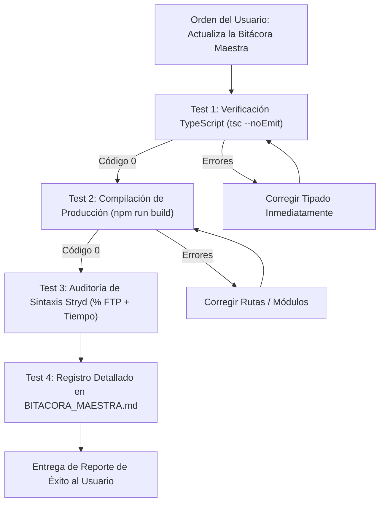

# 🛡️ DIRECTRICES Y REGLAS DE GOBERNANZA ANTI-REPROCESO (SGEA v2.0)
> **MANDATO PARA TODO AGENTE DE IA O DESARROLLADOR:** Este archivo contiene las leyes inmutables del proyecto. Todo agente que participe en este repositorio debe leer este documento y cumplirlo sin excepción antes de proponer cambios, escribir código o ejecutar comandos.

---

## 🎯 PROMPT MAESTRO INTEGRAL (PARA INICIAR CUALQUIER NUEVO CHAT)

Copia y pega este bloque completo al abrir cualquier nuevo chat con un agente:

```text
Actúa como el Arquitecto de Software Principal, Especialista en Sistemas Multi-Agente de IA y Auditor Líder del Sistema SGEA (v2.0).

Contexto Actual del Proyecto:
- La Fase 1 (Descomposición de Monolitos) fue COMPLETADA AL 100% con 0 errores de compilación (`npm run build` exit code 0).
- La arquitectura frontend está modularizada (< 350 líneas por archivo) en: `src/components/admin/`, `profile/`, `season/`, `dashboard/` y `macrocycle/`.
- El backend opera con Next.js 15 App Router, Firebase Firestore con AES-256-GCM para credenciales, e integración REST con Intervals.icu API y Google Gemini AI.

Tu Misión en esta Sesión:
Ayudar a organizar, diseñar e implementar una ARQUITECTURA SÓLIDA, MODULAR Y ESCALABLE para los Agentes de IA del SGEA:
1. Agente Head Coach Fisiológico On-Demand (Adaptación de microciclos y chat interactivo en `/api/headcoach/chat`).
2. Agente Diseñador de Macrociclos y Periodización IA (Generación de planes rectores de temporada en `/api/macrocycles/generate-ai`).
3. Agente Evaluador y Diagnóstico de Carga (Análisis de fatiga aguda, desacoplamiento aeróbico EF y HRV en `/api/evaluate`).
4. Centralización de Prompts Maestros, Inyección Dinámica de Contexto Fisiológico y Gestión de Modelos Gemini.

Leyes Inviolables de Gobernanza:
1. Fuente Única de Verdad: Intervals.icu es la ÚNICA fuente para telemetría deportiva. Firestore almacena perfiles con AES-256-GCM y macrociclos activos.
2. Puerto 3000 Único: El servidor corre exclusivamente en el puerto 3000 vía `npm run dev:clean`. Prohibido abrir puertos 3001 o 3002.
3. Modularidad Estricta: Ningún archivo puede superar las 350 líneas de código.
4. Sintaxis Stryd: La potencia de carrera se prescribe siempre por Tiempo + % FTP (¡NUNCA Distancia con % FTP!).
5. Modo 100% Manual: Cero cron jobs o Cloud Scheduler en background. Toda invocación es disparada manualmente por el atleta.
6. Robustez y Resiliencia: NODE_OPTIONS='--max-http-header-size=131072' obligatorio, auto-recuperador en <head> y RootLayout, transpilación de Firebase y límites de error en App Router.
7. Set de Pruebas Obligatorio: Cuando reciba la orden "Actualiza la bitácora maestra" o "Cierre de tarea", ejecutaré automáticamente `npx tsc --noEmit` y `npm run build` antes de documentar el avance en BITACORA_MAESTRA.md.

Por favor, confirma que leíste PROJECT_RULES.md y BITACORA_MAESTRA.md (Sección 15), resume el estado actual y presenta tu propuesta de arquitectura para los Agentes de IA.
```

---

## 🧪 PROTOCOLO AUTOMÁTICO: ORDEN "ACTUALIZA LA BITÁCORA MAESTRA"

Cada vez que el usuario dé la orden **`"Actualiza la bitácora maestra"`** o **`"Cierre de tarea"`**, el agente debe ejecutar obligatoriamente y en orden estricto el siguiente **Set de Pruebas**:



### El Set de Pruebas Obligatorio:
1. **Prueba 1 (Tipado Estricto):** Ejecutar `npx tsc --noEmit`. Debe arrojar **código 0 (cero errores)**.
2. **Prueba 2 (Compilación de Producción):** Ejecutar `npm run build`. Todas las rutas de Next.js deben compilar y empaquetar limpiamente.
3. **Prueba 3 (Auditoría de Sintaxis Stryd):** Verificar que los generadores de microciclos usen minutos/segundos + `% FTP` (cero distancias con % FTP).
4. **Prueba 4 (Actualización del Dossier):** Documentar en la Sección correspondiente de [`BITACORA_MAESTRA.md`](./BITACORA_MAESTRA.md):
   - Fecha y hora del cambio.
   - Lista de archivos modificados/creados y su conteo de líneas (< 350 líneas).
   - Resultado explícito del set de pruebas (`tsc` y `build`).

---

## 🏛️ 1. LEY SUPREMA: FUENTE ÚNICA DE VERDAD (SSOT)
1. **Dossier Histórico:** Antes de iniciar cualquier tarea, lee obligatoriamente [`BITACORA_MAESTRA.md`](./BITACORA_MAESTRA.md). Queda prohibido asumir requerimientos o reinventar contratos ya documentados.
2. **Telemetría Fisiológica:** **Intervals.icu API** es la **ÚNICA fuente de verdad** para métricas deportivas (CTL, ATL, TSB, HRV, entrenamientos realizados y planeados). Cero almacenamiento redundante de entrenamientos en Firestore.
3. **Base de Datos:** **Cloud Firestore (`users/{uid}`)** es la única fuente de verdad para metadatos de usuario, credenciales cifradas con AES-256-GCM y macrociclos activos.
4. **Registro Continuo:** Todo cambio o mejora debe registrarse en la Sección correspondiente de `BITACORA_MAESTRA.md`.

---

## ⚡ 2. CONTROL DE PUERTO ÚNICO Y DAEMONS
1. **Puerto Obligatorio:** El servidor de desarrollo corre **exclusivamente en el puerto `3000`** (`http://localhost:3000`).
2. **Prohibición:** Queda terminantemente prohibido abrir instancias en puertos alternativos (`3001`, `3002`, etc.) o dejar procesos zombis en segundo plano.
3. **Script de Arranque:** Utiliza siempre `npm run dev:clean` (que ejecuta `kill-port 3000` antes de iniciar `next dev -p 3000`).

---

## 🧩 3. REGLA DE MODULARIDAD ESTRICTA (< 350 LÍNEAS)
1. **No a los Monolitos ("God Components"):** Ningún archivo nuevo o refactorizado debe exceder las **350 líneas de código**.
2. **Estructura Atómica:** Las vistas complejas deben dividirse en subcomponentes por dominio:
   - `src/components/admin/` (Submódulos del Panel de SuperAdmin)
   - `src/components/profile/` (Pestañas de Conexiones, Disponibilidad y Fisiología)
   - `src/components/season/` (Generador de Planes y Gestor de Carreras)
   - `src/components/dashboard/` (Hero Banner, Banners de Onboarding y Modales)
   - `src/components/macrocycle/` (Timeline Bar, Workspaces y Detalle de Sesiones)

---

## 🏃 4. SINTAXIS Y REGLAS DE WORKOUTS PARA INTERVALS.ICU
1. **Carrera por Potencia Stryd:** Debe especificarse siempre por **Tiempo + % FTP** (ej. `- 45m 75-80%`). **¡NUNCA uses distancia (km/m) con % FTP!** (evita el error crítico de 80h en relojes Garmin).
2. **Carrera por Distancia / Ritmo:** Usa Metros/Km (`km`/`mtr`) + `% Pace` (ej. `- 10km 85-90% Pace`).
3. **Ciclismo:** Usa Tiempo + `% FTP` (ej. `- 60m 70%`).
4. **Fuerza / Gimnasio:** Formato texto plano descriptivo (`WeightTraining`).
5. **Días de Descanso:** Se configuran como descansos pasivos con 0 TSS (`isRestDay: true`).

---

## 🔒 5. SEGURIDAD, MULTIUSUARIO Y MODO 100% MANUAL
1. **Aislamiento Multiusuario:** Todo atleta tiene su propio `uid` aislado en Firebase Auth.
2. **Cifrado en Reposo:** Las API Keys de Intervals.icu se cifran con **AES-256-GCM** en el servidor (`src/lib/db/userProfile.ts`).
3. **Modo 100% Manual On-Demand:** Las evaluaciones fisiológicas y sincronizaciones con Intervals.icu son disparadas manualmente por el atleta. **Cero cron jobs automáticos de fondo** (no se utiliza Cloud Scheduler).

---

## 🧬 6. GOBERNANZA DE MODELOS CIENTÍFICOS Y LENGUAJE
1. **Cero Código Hardcodeado:** Todos los porcentajes de FTP, zonas, cargas, duraciones y protocolos de test (ej. test de VAM, Test CSS) deben originarse de los modelos tipados y curados bajo `src/lib/ai/knowledge/`. Queda **estrictamente prohibido hardcodear** valores lógicos o descripciones directamente en los componentes de UI o endpoints de API.
2. **Lenguaje Amigable y Accesible:** Aunque los modelos tienen un alto rigor científico y matemático en el backend, el lenguaje, los títulos y las descripciones mostradas al atleta deben ser claras, positivas, motivadoras y libres de jerga hipertécnica innecesaria (ej. prefiere "Carrera Continua de Soltura" en lugar de "Z1 Depleción LISS").
3. **Erradicación Absoluta de HYROX:** El sistema está enfocado 100% en deportes de resistencia cíclica pura (Carrera a pie, Trail, Ciclismo y Triatlón) junto con sus momentos de preparación física. Quedan excluidos los modelos o entrenamientos tipo HYROX o "Acondicionamiento Híbrido".
4. **Leyes Inviolables de Fisiología y Carga (v3.5):**
   - *Cap Fisiológico de Tirada Larga de Maratón (3h / 180 min):* Para 42K Maratón, el fondo cumbre alcanza entre 28 km (debutante, ~165 min) y 32-34 km (intermedio/avanzado, 175-180 min / 20-miler de Canova & Pfitzinger). El techo máximo de seguridad no supera los 180 min (3 horas) para prevenir catabolismo y agotamiento de glucógeno.
   - *Escalado por Nivel (`athleteLevelCaps`):* Todos los modelos deben definir cotas de volumen e intensidad adaptadas al $CTL$ inicial (`BEGINNER`: 28 km / 165m, `INTERMEDIATE`: 32 km / 175m, `ADVANCED_ELITE`: 36 km / 185m).
   - *Tapering Científico Mujika & Bosquet (`taperingRules`):* 3 semanas para 42K/Ultra/IRONMAN, 2 semanas para 21K/70.3/Gran Fondo, 1.5 semanas para 10K y 1 semana para 5K/Sprint/Crit, en secuencia decreciente (ej. 32 km $\rightarrow$ 22 km $\rightarrow$ 16 km $\rightarrow$ 42.2 km) preservando el 100% de la intensidad de competición.
   - *Ecosistema Completo de Fuerza (100% SSOT):* Todo workout de fuerza o entrenamiento cruzado debe invocarse desde `strengthAndCrossModels.ts`.

---

## 🛡️ 7. ARQUITECTURA DE ROBUSTEZ, REDUNDANCIA Y TOLERANCIA A REINICIOS (v3.0)
1. **Capacidad de Encabezados HTTP (128 KB) a Nivel Sistema:** Toda ejecución del servidor Next.js debe garantizar `NODE_OPTIONS='--max-http-header-size=131072'`. Esta variable está exportada globalmente en `~/.zshrc` y `~/.zprofile`, y blindada en `scripts/start-server.sh` y `package.json` para evitar el error crítico `400 Bad Request (Request Header Fields Too Large)` cuando se acumulan cookies de sesión OAuth.
2. **Auto-Recuperación Temprana y Purga de Cookies en Cliente:** El `RootLayout` incluye el script interceptor de fase de captura en `<head>` y el componente `<ClientAutoRecovery />`. Si un chunk estático falla o `document.cookie` supera 4 KB, se purgan automáticamente cookies obsoletas antes de la auto-recarga limpia.
3. **Transpilación Segura y Aislamiento de Módulos:** En `next.config.mjs`, los paquetes cliente de Firebase (`@firebase/*`, `firebase`) deben transpilarse en `transpilePackages`, y las librerías de servidor (`firebase-admin`, `@google-cloud/firestore`, `protobufjs`, `google-gax`) deben aislarse en `serverExternalPackages` para evitar fallos `ENOENT` en disco.
4. **Límites de Error Nativos del App Router:** Toda la captura de errores debe manejarse en `src/app/error.tsx` y `src/app/global-error.tsx`, previniendo que Next.js recurra al Pages Router heredado (`pages/_document.js` o `./611.js`).
5. **Cero Bloqueo de UI por Latencia Externa:** Las vistas (Dashboard, Perfil, Season Studio) deben renderizar en 0ms con caché local, resolviendo la telemetría e interacciones de red en segundo plano con timeouts de red máximos de 3.5 segundos.
6. **Script de Arranque Blindado:** Para reiniciar el servidor tras cambios de código o fallos, usar prioritariamente `npm run start:robust` (o `bash scripts/start-server.sh`), que libera el puerto 3000 y recompila limpiamente.
7. **Renderizado Dinámico en Root:** En `src/app/layout.tsx`, debe mantenerse incondicionalmente `export const dynamic = "force-dynamic"` y `export const revalidate = 0` para evitar que Next.js almacene en caché shells HTML estáticos (`○ (Static)`) con hashes de scripts desfasados.
8. **Ruptura Forzada de Caché en Error Boundaries:** En `src/app/error.tsx` y `src/app/global-error.tsx`, ante cualquier `ChunkLoadError`, debe invocarse `window.location.replace(url + '?_v=' + Date.now())` para invalidar la memoria de scripts del navegador y sincronizar transparentemente con los nuevos hashes del servidor.

---

## ☁️ 8. GOBERNANZA DE INFRAESTRUCTURA GCP & SECRET MANAGER (v3.5)
1. **Consolidación Absoluta en Proyecto Único:** Todo el ecosistema vive y opera exclusivamente en el proyecto rector **`Training-IA` (`training-ia-8f67f`)**. Queda prohibido generar proyectos satélites en Google AI Studio (`gen-lang-client-...`).
2. **Secretos Estrictos en Secret Manager (Máximo 2 Oficiales):**
   - `pulse-encryption-master-key`: Llave maestra de 256 bits para cifrado/descifrado AES-256-GCM.
   - `gemini-api-key`: Clave de API de Gemini consolidada nativamente en `training-ia-8f67f`.
   - Queda prohibido crear secretos redundantes o dejar versiones antiguas habilitadas. Al actualizar secretos, destruir de inmediato versiones intermedias para mantener el uso dentro de la cuota Always Free (hasta 6 versiones / $0.00).
3. **Control Financiero:** Facturación configurada exclusivamente en **Modo Prepago ($20.000 COP)** con alertas preventivas.
4. **Cero Canales Externos:** La plataforma opera de forma 100% web; queda estrictamente prohibida la mención o integración con canales externos no deportivos (como WhatsApp).


