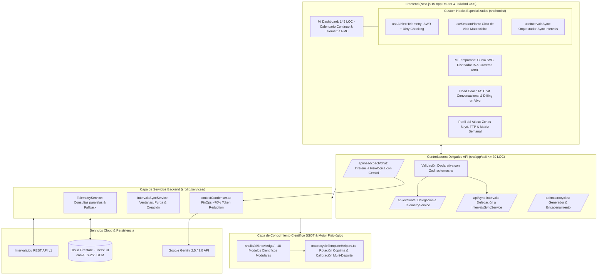

# ⚡ SGEA Pro (v3.36) — Sistema Adaptativo de Entrenamiento Inteligente
> **Plataforma de Alto Rendimiento Fisiológico, Periodización Dinámica y Prescripción Adaptativa con IA para Deportes de Resistencia (Carrera, Ciclismo y Triatlón).**

---

## 🌟 Características Principales

- 📊 **Calendario Continuo & Telemetría Banister:** Visualización de carga en vivo estilo Intervals.icu con seguimiento de Fitness (CTL), Fatiga (ATL), Forma (TSB) y Balance de Carga semanal.
- 🤖 **Head Coach Digital con IA (Google Gemini):** Análisis cualitativo y cuantitativo del estado del atleta, adaptación de microciclos y chat interactivo con diffing de workouts.
- 🎯 **Escalabilidad Universal Multi-Deporte (SSOT):** 18 modelos especializados que cubren cualquier distancia: 5K, 10K, 21K, 42K, Trail/Ultra, Ciclismo (Fondo, Escalada, Criterium) y Triatlón (Sprint, Olímpico, 70.3, 140.6) para planes de 4 a 24+ semanas.
- 🔄 **Motor Anti-Repetición con Rotación Coprima:** Algoritmo matemático $\gcd(L, s) = 1$ para variación continua semana tras semana sin sesiones idénticas consecutivas y sufijo dinámico `(Progresión Bloque II)` en ciclos extendidos.
- 📅 **Día de Carrera Flexible (Sábado o Domingo):** Ubicación automática de la competición oficial en Sábado o Domingo con asignación de descanso regenerativo post-carrera.
- ⚡ **Integración Nativa con Stryd & Garmin (100% Legal):** Prescripción estricta por Tiempo + % CP/FTP en carrera (cero distancias con % CP), auditada en 448 entrenamientos generados.
- 🔄 **Capa de Servicios & Controladores Delgados:** Lógica desacoplada en `src/lib/services/` con rutas API ultraligeras ($\le 30\text{ LOC}$) y validación declarativa estricta con **Zod**.
- 💰 **Gobernanza FinOps & Compresión de Contexto:** Condensador de actividades ejecutadas a formato tabular ultra-denso (`contextCondenser.ts`), ahorrando **~70% en tokens** de entrada a Gemini.
- 🚀 **Resiliencia SWR & Firestore Dirty Checking:** Caché en memoria de telemetría (TTL 3 min) y control de mutaciones con `useRef` para eliminar llamadas y escrituras redundantes.
- 🔒 **Seguridad y Criptografía:** Autenticación Google OAuth vía Firebase Auth y almacenamiento de API Keys en Cloud Firestore cifradas con **AES-256-GCM**.
- 🛠️ **Arquitectura 100% Modular:** Todos los componentes UI desacoplados en submódulos atómicos (< 350 líneas de código) y `AthleteDashboard.tsx` en **145 LOC** (< 160 LOC).

---

## 🏛️ Arquitectura del Sistema



---

## 🚀 Inicio Rápido (Desarrollo Local)

### 1. Requisitos Previos
- **Node.js:** v20+ o v24+
- **NPM:** v10+
- Cuenta en [Intervals.icu](https://intervals.icu)

### 2. Instalación de Dependencias
```bash
npm install
```

### 3. Configuración de Variables de Entorno
Copia el archivo `.env.example` a `.env.local`:
```bash
cp .env.example .env.local
```
Configura tus credenciales de Firebase, Google Gemini API y tu clave maestra de cifrado (`ENCRYPTION_KEY`).

### 4. Arranque del Servidor en el Puerto 3000
> **IMPORTANTE:** Usa siempre el script `npm run dev:clean` para evitar conflictos con procesos zombis en puertos secundarios.
```bash
npm run dev:clean
```
Abre tu navegador en [http://localhost:3000](http://localhost:3000).

---

## 📁 Mapa del Repositorio

```text
IA Training/
├── BITACORA_MAESTRA.md             # Dossier histórico, memoria central y changelog
├── PROJECT_RULES.md               # Leyes de gobernanza inmutables y prompt maestro
├── BACKLOG_MEJORAS_ARQUITECTURA.md # Backlog de auditoría técnica y refactorizaciones
├── README.md                      # Resumen visual, arquitectura y puesta en marcha
├── src/
│   ├── app/                       # Next.js App Router y API Routes delgadas (<= 30 LOC)
│   ├── components/                # Componentes UI organizados por dominio (< 350 LOC)
│   │   ├── admin/                 # Panel de SuperAdmin y monitor de tokens
│   │   ├── dashboard/             # AthleteDashboard (< 160 LOC), calendario y subcomponentes
│   │   ├── macrocycle/            # Línea de tiempo y visor de microciclos
│   │   ├── profile/               # Perfil del atleta y zonas de potencia
│   │   └── season/                # Estudio de temporada y curvas SVG
│   ├── context/                   # Contextos globales (AuthContext)
│   ├── hooks/                     # Custom Hooks (useAthleteTelemetry, useSeasonPlans, useIntervalsSync)
│   └── lib/                       # Lógica de negocio y motores fisiológicos
│       ├── ai/                    # Inferencia de IA, contextCondenser (FinOps), prompts
│       │   └── knowledge/         # 18 Modelos científicos SSOT modulares (5K, 10K, 21K, 42K, Trail, Ciclismo, Triatlón)
│       ├── db/                    # Persistencia Firestore y AES-256-GCM
│       ├── intervals/             # Cliente HTTP para Intervals.icu API
│       ├── physiology/            # Banister, macrociclos, rotación coprima anti-repetición y calibración multi-deporte
│       ├── services/              # Capa de Servicios Backend (TelemetryService, IntervalsSyncService)
│       └── validation/            # Esquemas de validación declarativos con Zod (schemas.ts)
```

---

## 🧪 Verificación de Calidad y Compilación

Para asegurar la integridad del código en cualquier momento:
```bash
# Verificación estricta de tipos TypeScript (Código 0)
./node_modules/.bin/tsc --noEmit

# Compilación y empaquetado de producción de Next.js (Código 0)
npm run build
```

---

## 📄 Licencia y Derechos
Desarrollado para la optimización biomecánica y fisiológica de atletas de resistencia.
