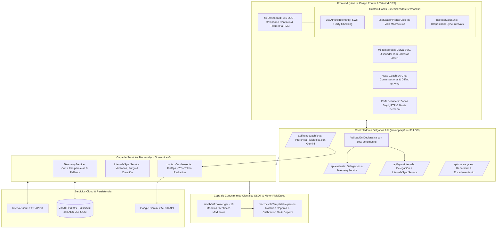

# ⚡ SGEA Pro (v3.64) — Sistema Adaptativo de Entrenamiento Inteligente
> **Plataforma de Alto Rendimiento Fisiológico, Periodización Dinámica y Prescripción Adaptativa con IA para Deportes de Resistencia (Carrera, Ciclismo y Triatlón).**

---

## 🌟 Características Principales

- 👤 **Modal Perfil del Atleta Minimalista & Sincronización Robusta:** Rediseño limpio del editor de perfil (`Perfil del Atleta`), eliminando sobrecarga visual y badges redundantes. Persistencia bidireccional inmediata y síncrona con Intervals.icu para Peso, Stryd CP, FTP, LTHR, Max HR y Resting HR resolviendo API Keys cifradas en Firestore sin condiciones de carrera.
- 📱 **Ergonomía Responsive Móvil & Plegado de Métricas:** En smartphones, las métricas fisiológicas se pliegan a un carrusel horizontal compacto de pastillas (pills) de ~36px con toggle `Ver (6)` / `Plegar`, liberando más del 75% del viewport vertical. Conmutador dual entre **Detalle Diario** (con soporte gestual de swipe táctil horizontal) y **Agenda Semanal** (feed continuo estilo TrainingPeaks con descansos condensados en una sola fila).
- 📌 **Main Sticky Header Maestro Unificado (Desktop):** Bloque superior persistente (`position: sticky; top: 0; z-index: 50`) que ancla las tarjetas de métricas fisiológicas (Fitness CTL, Fatiga ATL, Forma TSB, Potencia), la barra de control con botón "Hoy" y la cabecera semanal de días (Lunes a Domingo), permitiendo que el scroll del calendario fluya por debajo sin perder nunca la visión de la condición física ni los controles rápidos.
- 📅 **Calendario Unificado de Año Completo (Scroll Continuo Estilo Intervals.icu):** Eliminación de tabs separadores. Un único flujo vertical donde las semanas futuras planificadas se proyectan hacia arriba (scroll up), la semana actual queda anclada al entrar al dashboard, y el historial de entrenamientos ejecutados (hasta 52 semanas / 1 año) se extiende hacia abajo (scroll down).
- 🗂️ **Tarjetas de Sesión Minimalistas y Especializadas:** Tarjetas limpias en 3 zonas (Header, Título, Footer) con pista de expansión (`ChevronRight` en hover). Carrera y Ciclismo mantienen su gráfica de intervalos y zonas de potencia (`WorkoutChart`) compacta; Fuerza/Gimnasio presenta descripción concisa de ejercicios ($\le 60$ caracteres), delegando la sintaxis y prescripción detallada al modal interactivo.
- 🔁 **Sincronización Tri-Semanal & Recalibración Adaptativa (2:1):** Botón para despachar bloques fisiológicos de 3 semanas (2 de carga + 1 de asimilación/descarga) a Intervals.icu con recalibración continua según la evolución real del atleta.
- ⚖️ **Sincronización Bidireccional de Peso y Wellness:** Registro y despacho automático del peso corporal del atleta directo hacia Intervals.icu (`/athlete/{id}` y `/wellness/{date}`).
- 💾 **Persistencia Explícita de Matriz de Disponibilidad:** Panel de disponibilidad deportiva con persistencia manual segura ("Guardar Matriz") y restablecimiento instantáneo a la Matriz Canónica anti-colisiones.
- 🏔️ **Respeto Estricto de Max CTL Histórico:** Generación de macrociclos que toma el pico real de fitness histórico del atleta como meta cumbre, erradicando topes artificiales.
- 🧘 **Desacoplamiento Total de Movilidad y Nutrición:** Pautas de calentamiento dinámico y nutrición/hidratación intra-sesión aisladas como campos informativos complementarios independientes (`mobilityWarmup` y `fuelingStrategy`), garantizando un `workoutDoc` 100% puro para la sincronización con Garmin e Intervals.icu.
- 🚴 **Matriz Semanal Canónica & Prevención de Ciclismo Consecutivo:** Alternancia biológica optimizada (Martes Carrera, Miércoles Ciclismo Rodillo, Jueves Fuerza, Sábado Ciclismo Fondo, Domingo Tirada Larga) con saneamiento automático de colisiones.
- 🗣️ **Lenguaje Claro y Comprensible para el Atleta:** Erradicación de jerga de laboratorio oscura ("base mitocondrial" $\rightarrow$ base aeróbica Z2, "telemetría PMC" $\rightarrow$ forma y fatiga) manteniendo la precisión fisiológica en el acordeón técnico bajo demanda.
- 📊 **Telemetría Banister en Vivo:** Seguimiento en tiempo real de Fitness (CTL), Fatiga (ATL), Forma (TSB) y Balance de Carga semanal con telemetría viva conectada a Intervals.icu.
- 🤖 **Head Coach Fisiológico con Consola Táctica Guiada (FinOps):** Interacción en 2 niveles (Semanal y Diario) que elimina el input abierto de texto libre para blindar el consumo de tokens y erradicar alucinaciones.
- 🎯 **Saludo Ejecutivo & Métricas de Adherencia en Tiempo Real:** Visualización dinámica de cumplimiento semanal (`¡Objetivo completado al 100%!`), telemetría Banister viva (CTL, ATL, TSB, HRV) y prescripción técnica sin preguntas abiertas redundantes.
- 🟢 **Criterio de Oro de Continuidad del Plan:** Decisión matemática estricta que dictamina `CONTINUIDAD DEL PLAN` (`actionType: "REVIEW_PHYSIOLOGY"`) y preserva intactas las sesiones (`action: "MANTENER"`) cuando la adherencia es $\ge 80\%$, TSB $\ge -15$ y RPE $\le 6/10$.
- 🏃 **Auditoría de Carga Interna (RPE 1-10, Feel & Wellness):** Cruce sistemático de la carga externa (vatios/TSS) con la percepción del esfuerzo del atleta, dolor muscular (`soreness`) y calidad de sueño.
- 🎨 **Iconografía Deportiva Vectorial Profesional:** Erradicación total de emojis infantiles en prompts y UI, reemplazados por componentes SVG vectoriales de `lucide-react`.
- 🎯 **Escalabilidad Universal Multi-Deporte (SSOT):** 18 modelos especializados que cubren cualquier distancia: 5K, 10K, 21K, 42K, Trail/Ultra, Ciclismo (Fondo, Escalada, Criterium) y Triatlón (Sprint, Olímpico, 70.3, 140.6) para planes de 4 a 24+ semanas.
- 🏋️ **Suite Especializada de Fortalecimiento (S&C):** Agentes de fuerza biomecánica dedicados para Running, Ciclismo, Triatlón, Trail y Prehab/Longevidad.
- 🔄 **Motor Anti-Repetición con Rotación Coprima:** Algoritmo matemático $\gcd(L, s) = 1$ para variación continua semana tras semana sin sesiones idénticas consecutivas.
- 📅 **Día de Carrera Flexible (Sábado o Domingo):** Ubicación automática de la competición oficial en Sábado o Domingo con asignación de descanso regenerativo post-carrera.
- ⚡ **Integración Nativa con Stryd & Garmin (100% Legal):** Prescripción estricta por Tiempo + % CP/FTP en carrera (cero distancias con % CP).
- 🔄 **Capa de Servicios & Controladores Delgados:** Lógica desacoplada en `src/lib/services/` con rutas API ultraligeras ($\le 30\text{ LOC}$) y validación declarativa con **Zod**.
- 💰 **Gobernanza FinOps & Compresión de Contexto:** Condensador de actividades ejecutadas a formato tabular ultra-denso (`contextCondenser.ts`), ahorrando **~70% en tokens**.
- 🚀 **Resiliencia SWR & Firestore Dirty Checking:** Caché en memoria de telemetría (TTL 3 min) y control de mutaciones con `useRef` para eliminar llamadas y escrituras redundantes.
- 🔒 **Seguridad y Criptografía:** Autenticación Google OAuth vía Firebase Auth y almacenamiento de API Keys en Cloud Firestore cifradas con **AES-256-GCM**.
- 🛠️ **Arquitectura 100% Modular:** Presupuesto estricto de código (< 350 LOC por archivo) y `AthleteDashboard.tsx` en **145 LOC** (< 160 LOC).

---

## 🤖 Ecosistema Integral de Agentes Inteligentes

```
                                      JERARQUÍA MULTI-AGENTE SGEA
┌────────────────────────────────────────────────────────────────────────────────────────────────────────┐
│                                       PULSE HEAD COACH (ORQUESTADOR)                                  │
└───────────────────────────────────────────────────┬────────────────────────────────────────────────────┘
                                                    │
             ┌──────────────────────────────────────┼──────────────────────────────────────┐
             │                                      │                                      │
             ▼                                      ▼                                      ▼
┌─────────────────────────┐            ┌─────────────────────────┐            ┌─────────────────────────┐
│  CAPA 1: FISIOLÓGICA    │            │  CAPA 2: FORTALECIMIENTO│            │  CAPA 3: INGENIERÍA     │
│  (8 Agentes de Runtime) │            │  (5 Coaches S&C)        │            │  (3 Leads & 12 Subags)  │
│  • Live Coach           │            │  • S1: Running / Maratón│            │  • Lead Backend         │
│  • Macrocycle Architect │            │  • S2: Cycling / Puerto │            │  • Lead Frontend UX/UI  │
│  • Daily Physio Auditor │            │  • S3: Triathlon Multi  │            │  • Lead QA & Debugging  │
│  • Library Curator      │            │  • S4: Trail / D- Excen │            │                         │
│  • 365d Profiler        │            │  • S5: Prehab/Longevity │            │                         │
│  • Race Debrief/Recalib │            │                         │            │                         │
│  • Fueling & Hydration  │            │                         │            │                         │
│  • Dynamic Warmup/Mob   │            │                         │            │                         │
└─────────────────────────┘            └─────────────────────────┘            └─────────────────────────┘
```

### 🧠 Capa 1: Los 8 Agentes Fisiológicos de Runtime
1. **Agente 01 (`PULSE Live Coach`):** Coach adaptativo conversacional on-demand en `/api/headcoach/chat`.
2. **Agente 02 (`PULSE Macrocycle Architect`):** Generador de periodización macrocíclica en `/api/macrocycles/generate-ai`.
3. **Agente 03 (`PULSE Daily Physio Auditor`):** Auditor de carga Banister y Z-score HRV en `/api/evaluate`.
4. **Agente 04 (`PULSE Program Library Curator`):** Generador de catálogo maestro de programas predefinidos.
5. **Agente 05 (`PULSE Long-Term Adaptation Profiler`):** Perfilador de memoria y asimilación biológica a 365 días.
6. **Agente 06 (`PULSE Race Debrief & Threshold Recalibrator`):** Auditor de debriefing post-carrera y recalibrador de Stryd CP / Bike FTP.
7. **Agente 07 (`PULSE Intra-Workout Fueling & Hydration Strategist`):** Estratega de carbohidratos (60-90g CHO/h), sodio y líquidos.
8. **Agente 08 (`PULSE Dynamic Mobility & Neuromuscular Warmup Engine`):** Motor de calentamiento neuromuscular estructurado en reloj.

### 🏋️ Capa 2: Suite de 5 Coaches de Fortalecimiento Especializados (S&C)
| Agente S&C | Foco Biomecánico | Prescripción Clave | Métrica de Impacto |
| :--- | :--- | :--- | :--- |
| **S1: Running** | Sóleo, Aquiles, Stryd LSS, Glúteo Medio | Elevaciones excéntricas de talón, Hip Thrust, Pliometría reactiva | Stryd LSS $\uparrow$, GCT $< 210\text{ ms}$, $\text{kJ/km} \downarrow$ |
| **S2: Cycling** | Cuádriceps (fase empuje), Glúteo mayor, Core lumbar | Sentadilla pesada 80% 1RM, Prensa unilateral, Plancha prona isométrica | Torque subida ($50\text{--}60\text{ rpm}$), W/kg $\uparrow$ |
| **S3: Triathlon** | Dorsal ancho, Manguito rotador, Transición Brick | Jalón al pecho, Rotaciones externas banda, Squats con salto post-rodillo | Prevención *Swimmer's Shoulder*, Ritmo post-T2 |
| **S4: Trail** | Cuádriceps excéntrico (D-), Peroneos de tobillo | Sentadilla búlgara con descenso lento (4s), Propiocepción en BOSU | Mitigación daño excéntrico (DOMS), Estabilidad |
| **S5: Prehab** | Isometría de tendones, Equilibrio H:Q, Masa magra | Spanish Squats isométricos (45s), Curl femoral nórdico, Peso muerto rumano | $\text{ACWR} \le 1.3$, Cero bajas por sobreuso |

### 💻 Capa 3: Agentes Lead de Ingeniería & 12 Subagentes
- **Lead Backend & Motores Fisiológicos:** Subagente 1.1 (Intervals Sync Engine), Subagente 1.2 (Cloud Persistence & AES-256), Subagente 1.3 (LLM FinOps), Subagente 1.4 (Periodization Engine).
- **Lead Frontend & UX/UI Deportiva:** Subagente 2.1 (Continuous Calendar), Subagente 2.2 (Custom Hooks & SWR Cache), Subagente 2.3 (Head Coach Chat), Subagente 2.4 (Biometrics & Zones).
- **Lead Auditor Técnico, QA & Debugging:** Subagente 3.1 (Type Safety Sentinel), Subagente 3.2 (Port 3000 Governor), Subagente 3.3 (Stryd Syntax Validator), Subagente 3.4 (Modular & LOC Budget Auditor).

---

## 🏛️ Arquitectura del Sistema



---

## 🚀 Inicio Rápido (Desarrollo Local)

### 1. Requisitos Previos
- **Node.js:** v20+ o v24+
- **NPM:** v10+
- Cuenta en [Intervals.icu](https://intervals.icu)

### 2. Instalación de Dependencias
```bash
npm install
```

### 3. Configuración de Variables de Entorno
Copia el archivo `.env.example` a `.env.local`:
```bash
cp .env.example .env.local
```
Configura tus credenciales de Firebase, Google Gemini API y tu clave maestra de cifrado (`ENCRYPTION_KEY`).

### 4. Arranque del Servidor en el Puerto 3000
> **IMPORTANTE:** Usa siempre el script `npm run dev:clean` para evitar conflictos con procesos zombis en puertos secundarios.
```bash
npm run dev:clean
```
Abre tu navegador en [http://localhost:3000](http://localhost:3000).

---

## 📁 Mapa del Repositorio

```text
IA Training/
├── BITACORA_MAESTRA.md             # Dossier histórico, memoria central y changelog
├── PROJECT_RULES.md               # Leyes de gobernanza inmutables y prompt maestro
├── BACKLOG_MEJORAS_ARQUITECTURA.md # Backlog de auditoría técnica y refactorizaciones
├── README.md                      # Resumen visual, arquitectura y puesta en marcha
├── src/
│   ├── app/                       # Next.js App Router y API Routes delgadas (<= 30 LOC)
│   ├── components/                # Componentes UI organizados por dominio (< 350 LOC)
│   │   ├── admin/                 # Panel de SuperAdmin y monitor de tokens
│   │   ├── dashboard/             # AthleteDashboard (< 160 LOC), calendario y subcomponentes
│   │   ├── macrocycle/            # Línea de tiempo y visor de microciclos
│   │   ├── profile/               # Perfil del atleta y zonas de potencia
│   │   └── season/                # Estudio de temporada y curvas SVG
│   ├── context/                   # Contextos globales (AuthContext)
│   ├── hooks/                     # Custom Hooks (useAthleteTelemetry, useSeasonPlans, useIntervalsSync)
│   └── lib/                       # Lógica de negocio y motores fisiológicos
│       ├── ai/                    # Inferencia de IA, contextCondenser (FinOps), prompts
│       │   └── knowledge/         # 18 Modelos científicos SSOT modulares (5K, 10K, 21K, 42K, Trail, Ciclismo, Triatlón)
│       ├── db/                    # Persistencia Firestore y AES-256-GCM
│       ├── intervals/             # Cliente HTTP para Intervals.icu API
│       ├── physiology/            # Banister, macrociclos, rotación coprima anti-repetición y calibración multi-deporte
│       ├── services/              # Capa de Servicios Backend (TelemetryService, IntervalsSyncService)
│       └── validation/            # Esquemas de validación declarativos con Zod (schemas.ts)
```

---

## 🧪 Verificación de Calidad y Compilación

Para asegurar la integridad del código en cualquier momento:
```bash
# Verificación estricta de tipos TypeScript (Código 0)
./node_modules/.bin/tsc --noEmit

# Compilación y empaquetado de producción de Next.js (Código 0)
npm run build
```

---

## 📄 Licencia y Derechos
Desarrollado para la optimización biomecánica y fisiológica de atletas de resistencia.

