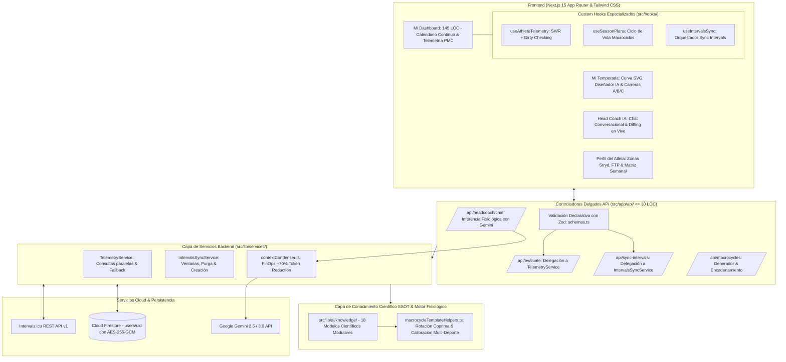

# ⚡ SGEA Pro (v4.07) — Sistema Adaptativo de Entrenamiento Inteligente
> **Plataforma de Alto Rendimiento Fisiológico, Periodización Dinámica, Prescripción Adaptativa y Gestión Deportiva SSOT con IA para Deportes de Resistencia (Carrera, Ciclismo y Triatlón).**

---

## 🌟 Características Principales

- 🏁 **Superposición Fisiológica de Carreras, Carrera por Ritmo & Hidratación Viva en Auditoría Admin (v4.07):**
  - **Inferencia Semántica & Superposición Atómica de Competiciones (`raceDayOverlay.ts`):** Inferencia exacta de disciplina real: pruebas como el *Giro de Rigo* o *Gran Fondos* se clasifican inequívocamente como **Ciclismo puro** (nunca atletismo). El día de la prueba se asigna `🏁 COMPETICIÓN B: Giro de Rigo (Ciclismo)` ($240\text{m}$, $210\text{ TSS}$, $68\text{-}78\%\text{ FTP}$), suprimiendo la tirada a pie y natación simultáneas; la víspera (sábado) se convierte en pedaleo de activación neuromuscular ($35\text{m Z1}$) y el lunes posterior en rodillo regenerativo o descanso pasivo.
  - **Variación Metodológica y Fartleks Rotativos (`fridayWorkoutResolver.ts` & `triathlonModel.ts`):** Erradicación total de entrenamientos monótonos al 80% Z2 continuo. Rotación programada de Fartleks aeróbicos piramidales Z2-Z3 ($1'-2'-3'-2'-1'$), carreras progresivas con final a ritmo 70.3, rodajes con strides neuromusculares ($105\%$ Pace), y bloques estructurados de Tempo Z3 extenso ($3\times 10\text{m}$, $2\times 15\text{m}$, $4\times 6\text{m}$ a ritmo $4:55\text{-}5:15\text{ min/km}$) con flotaciones activas y recuperaciones al $68\%$.
  - **Hidratación Inteligente de Calendario en Modo Auditoría Admin (`calendarHydration.ts`):** Al consultar el calendario en modo solo lectura desde la consola de administración (`isAuditing: true`), el sistema prioriza la prescripción viva del motor del macrociclo (`matchingFallback`) sobre eventos obsoletos de Intervals.icu marcados con `[PULSE AI]`, reflejando instantáneamente los nuevos entrenamientos en pantalla sin depender de purgas externas de Intervals.icu.
  - **Erradicación de Residuos de Potencia de Carrera en Atletas de Ritmo (`telemetryService.ts` & `PhysiologicalCards.tsx`):** Forzado de `runFtp = 0` para deportistas evaluados por ritmo (`runningTrainingMode === "PACE"` o sin potenciómetro); reemplazo automático de la tarjeta `strydCp` ("Potencia Run 400W") por `runPace` ("Ritmo Carrera: 4:45 min/km").

- 📈 **Telemetría de Alta Velocidad, Zonas Fisiológicas SSOT y Periodización Competitiva Inmediata (v4.05):**
  - **Distribución de Zonas Fisiológicas SSOT (`ActivityZoneDistribution`):** Mapeo canónico 1:1 con las zonas del perfil del atleta (`AthleteZonesViewer`):
    * **Carrera — Potencia (Stryd CP - 5 Zonas):** *Z1 Fácil (65-80% CP)*, *Z2 Moderado (80-90% CP)*, *Z3 Umbral (90-100% CP)*, *Z4 Intervalo (100-115% CP)*, *Z5 Repetición (115-300% CP)*, leyendo directamente `Z1` a `Z5` desde `icu_zone_times` de Intervals.icu.
    * **Frecuencia Cardíaca (7 Zonas LTHR):** *Z1 Recovery (0-83% LTHR)*, *Z2 Aerobic (83-88%)*, *Z3 Tempo (88-92%)*, *Z4 SubThreshold (93-98%)*, *Z5 SuperThreshold (98-100%)*, *Z6 Aerobic Capacity (101-103%)*, *Z7 Anaerobic (104%+)*, ingiriendo `icu_hr_zone_times` e `icu_hr_zones` en bpm.
    * **Carrera — Ritmo (Jack Daniels - 6 Zonas):** *Z1 Fácil (<75% Pace)*, *Z2 Moderado (75-85%)*, *Z3 Tempo (85-94%)*, *Z4 Umbral (95-104%)*, *Z5 Intervalo (105-115%)*, *Z6 Repetición (>115%)*, conectadas dinámicamente con `calculatePaceZones`.
    * **Ciclismo — Potencia (Coggan Power FTP - 7 Zonas):** *Z1 Recuperación*, *Z2 Resistencia (Fondo)*, *Z3 Tempo*, *Z4 Umbral (FTP)*, *Z5 VO2max*, *Z6 Cap. Anaeróbica*, *Z7 Neuromuscular*.
    * **Barra Apilada y Cuadrícula Adaptable:** Ancho proporcional al 100% real sin huecos ni desbordamientos, y grid responsivo inteligente (`grid-cols-5`, `lg:grid-cols-6`, `lg:grid-cols-7`).
  - **Telemetría Instantánea & Ergonomía en Sesiones Ejecutadas:** Desacoplamiento de streams pesados de GPS para carga ultra-rápida de telemetría multi-serie (Ritmo, Potencia, FC, Altitud); colapso automático de la prescripción estructurada en acordeón compacto y ocultamiento de calentamiento de movilidad en entrenamientos ya completados.
  - **Regla Head Coach de Entrada Directa a Fase de Pico (Peak Canova):** Para atletas con base fisiológica previa próximos a competir ($\le 4\text{ a }6\text{ semanas}$), el motor omite fases pasivas de mantenimiento y activa inmediatamente el bloque de Pico Específico con estímulos a ritmo objetivo, seguido de Tapering para maximizar la forma ($TSB > +5$).

- 🏛️ **Integración Nacional Bre-B (Banco de la República) y Pagos Directos BBVA Colombia (v4.04):**
  - **Estándar Interoperable Nacional Bre-B:** Adopción del nuevo sistema de pagos inmediatos de Colombia que permite a los atletas transferir instantáneamente desde cualquier banco o billetera digital (Bancolombia, Nequi, Daviplata, Scotiabank, etc.) escaneando el código QR o digitando la Llave Bre-B.
  - **Recaudo Directo en BBVA Colombia:** Configuración en la consola administrativa (`AdminPlansTab`) de la cuenta BBVA del coach Germán Morales: Llave Bre-B (Celular, Cédula, Correo o Alfanumérica), titular, tipo de cuenta, número de cuenta y QR interactivo.
  - **Experiencia de Pago Interoperable (`AthleteBreBPaymentModal` & `AthleteBillingBanner`):** Botón `[ Pagar con Bre-B / BBVA ]` en el portal del atleta, modal digital con 1-clic para copiar la llave, exhibición del QR y formulario de notificación inmediata de comprobantes.
  - **Gestión Financiera Reversible en Consola (`AdminBillingTable`):** Botón `[ ↺ Revertir a Pendiente ]` y `[ ✓ Aprobar Pago ]` para control total y reversible de la cartera mensual.
  - **Sincronización SSOT en Homepage (`LandingPricingSection`):** Card de precios y trust badge interoperable (*"Aceptamos Bre-B (BBVA), interoperable desde cualquier app o banco"*).
  - **Arquitectura de Resiliencia Backend & Erradicación de Error 500:** Endpoints de servidor (`/api/admin/subscription-plan` y `/api/billing/report-payment`) migrados a `adminDb` con captura resiliente y capa de caché en memoria de ejecución (`inMemoryPlanConfig`), previniendo caídas de permisos Firestore y asegurando respuestas `200 OK` en cualquier entorno de despliegue.

- 💳 **Módulo de Facturación & Cobro a Atletas (MRR) y Radar Fisiológico del Escuadrón (v4.02):**
  - **Foco Comercial Real:** Reemplazo de métricas decorativas de tokens IA por un sistema financiero y comercial directo para el Head Coach: seguimiento de ingresos recurrentes mensuales (MRR), total recaudado, saldo pendiente de cobro y porcentaje de recaudación en tiempo real.
  - **Control de Cobros 1-Clic (`AdminBillingTable`):** Registro instantáneo de pagos con un solo botón (`[ Marcar Pagado ]` / `[ Al día ]`), selector de moneda (USD, COP, EUR) y métodos de pago (Transferencia Bancaria, Stripe, Wompi, Efectivo).
  - **Radar Fisiológico y de Competencias del Escuadrón (`AdminSquadAthleticRadar`):** Supervisión simultánea del equipo completo: desglose de deportistas por potencia Stryd vs. ritmo Daniels, promedios de CP y FTP, y radar de carreras clave con cuenta regresiva en semanas (`W-X`).
  - **Edición Comercial en Ficha del Atleta (`AdminUserEditBillingSection`):** Configuración granular de precio mensual, moneda, día de corte y objetivos competitivos dentro del modal de administración.
  - **FinOps Discreto:** Degradación de las estadísticas de Gemini AI a una barra de estado inferior compacta para auditoría técnica de infraestructura sin desviar la atención operativa.

- 🖥️ **Consola de Administración Widescreen & Gestión Espaciosa de Atletas (v4.01):**
  - **Ampliación de Canvas a Pantallas Anchas (`max-w-[1720px]`):** Eliminación del contenedor restrictivo `max-w-7xl` ($1280\text{px}$) que dejaba 40-50% del monitor desaprovechado en monitores de escritorio. Ahora el Header, la consola de administración y el pie de página se expanden fluidamente con generoso padding interior (`p-6` a `p-10`).
  - **Fila Superior de KPIs Ejecutivos (`AdminUsersTab`):** 4 tarjetas métricas en la cabecera de Atletas (Total Usuarios, Activos con ratio %, Solicitudes Pendientes con alerta en ámbar, y Atletas vinculados con Intervals.icu) brindando control operativo instantáneo sin tener que contar filas.
  - **Barra de Búsqueda y Filtros de Alta Capacidad:** Buscador espacioso con botón interactivo de limpieza (`✕`), selector de rol, filtro de conexión con Intervals.icu y botón de refresco en vivo (`🔄 Refrescar`).
  - **Tabla de Gestión Espaciosa & Erradicación de Recortes (`AdminUsersTable`):** Filas con padding amplio (`py-4 px-6`), avatares grandes (`h-11 w-11`) con estado en vivo, chips fisiológicos diferenciados (`⏱️ Ritmo: 4:45/km` para corredores Daniels vs `⚡ Run CP: 336W` para Stryd y `🚴 Bike FTP: 228W`), y columna de acciones (`min-w-[340px]`) que garantiza que los botones `Ver como atleta`, `Configurar` y accesos rápidos NUNCA se corten en el borde de la pantalla.

- 📱 **Ergonomía Móvil Extrema & Sistema Ultra-Denso de Umbrales (Grid 3x2) (v4.00):**
  - **Reducción de Altura > 60% en Perfil Fisiológico (`AthleteProfileHeroCard`):** Sustitución del antiguo layout vertical (que requería > 400px en smartphones) por una matriz compacta de **3 columnas x 2 filas** (`grid-cols-3`). Fusión de biotipo y selector de modalidad (`⚡ Potencia | ⏱️ Ritmo`) en una sola línea de cabecera y tarjetas táctiles *tap-to-edit* con indicador sutil `✎` (~155px de altura total).
  - **Optimización de Pestañas del Dashboard (`AthleteDashboardOverview`):** Compactación de las vistas "Resumen & Calendario" y "Estado de Forma & Evolución" a un selector responsivo en cuadrícula móvil (`grid grid-cols-2 sm:inline-flex`), minimizando padding y escala tipográfica.
  - **Depuración Vertical en Head Coach (`HeadCoachHeader` & `HeadCoachWeekSelector`):** Supresión de badges fisiológicos redundantes (`CTL`, `ATL`, `TSB`), compactación de botones de navegación temporal ("Semana en Curso", "Próxima Semana") y chips táctiles de respuesta rápida.
  - **Visualización Inmediata de Zonas Fisiológicas (`AthleteZonesTab`):** Compactación de pastillas y márgenes verticales (`space-y-3 sm:space-y-6`) para que las tablas de zonas se sitúen en el viewport visible inicial sin desplazamiento forzado en móviles.

- 📊 **Curvas de Rendimiento Multi-Disciplina & Mejores Esfuerzos de Ritmo hasta 42K (v4.00):**
  - **Erradicación de "Todos los Deportes" & Especialización por Disciplina:** Vistas independientes y limpias para Ciclismo (Curva de Potencia MMP en W y W/kg), Carrera (Curva de Potencia Stryd y Curva de Ritmo Daniels) y Natación (Zonas CSS). Ingesta real directa desde la API de Intervals.icu (`/athlete/{id}/power-curves`).
  - **Tabla Especializada de Mejores Esfuerzos de Ritmo (`PaceBestEffortsTable`):** Desacoplamiento métrico para que los corredores por ritmo visualicen sus mejores esfuerzos en tiempo neto (`hh:mm:ss`) y ritmo medio (`min/km`) en lugar de vatios.
  - **Extensión Exhaustiva hasta Maratón (42.2K):** Inclusión de distancias canónicas completas: 400m, 1km, 1 mi, 3km, 5km, 10km, 15km, 21.1K (Media Maratón) y **42.2K (Maratón)** con renderizado SVG y tabular 100% responsivo.

- 🛡️ **Armonización Fisiológica & Purga Universal de Competiciones (v4.00):**
  - **Persistencia Fidedigna de Natación CSS:** Corrección del ciclo de persistencia en Firestore, `/api/profile` y la interfaz de usuario, erradicando el valor estático de 1:45/100m para guardar y recuperar el ritmo de CSS real configurado por el atleta.
  - **Unificación Canónica de FTP de Ciclismo:** Eliminación de inconsistencias numéricas cruzadas, fijando **228W** como la Fuente Única de Verdad (SSOT) en tarjetas, macrociclo y telemetría de Germán Morales.
  - **Deduplicación Fonético-Textual de Carreras (`seasonPlanHelpers.ts`):** Prevención de duplicados de la carrera objetivo primaria (ej. Maratón de Tokio) en el carrusel de carreras secundarias mediante `isSameRace` y `normalizeRaceText`.
  - **Exclusión de Competiciones Pasadas:** Filtro temporal reactivo (`date < todayStr`) que elimina carreras ya disputadas del carrusel de objetivos futuros.
  - **Purga Fisiológica Universal de Entrenamientos Camuflados (`isWorkoutSession`):** Detección y descarte automático de sesiones de entrenamiento en el panel de competiciones para todos los atletas (ej. George Schmitt), filtrando prefijos de microciclo (`S\d+:`, `W\d+:`), rutinas de movilidad y duraciones en el título.

- ⏱️ **Universalidad Fisiológica Multi-Atleta & Conmutación Dinámica de Modalidades (v3.99):**
  - **Arquitectura Reactiva Multi-Modalidad:** Erradicación de ataduras estáticas o hardcoded. Cada deportista conmuta dinámicamente entre Carrera por Potencia Stryd (`POWER`), Carrera por Ritmo Jack Daniels (`PACE`), Ciclismo por FTP (`BIKE`) y Natación por CSS (`SWIM`) según su perfil biométrico en Firestore (`runningTrainingMode`, `hasRunningPowerMeter`, `runFtp`, `runThresholdPaceStr`, `bikeFtp`, `swimCssStr`).
  - **Insignias Vivas en Zonas y Hero Card (`AthleteZonesViewer` & `AthleteProfileHeroCard`):** Activación visual en verde esmeralda de `ACTIVA RITMO` y atenuación de potencia (`CP/FTP`) para corredores de ritmo. Para corredores de Stryd (ej. Germán Morales, 336W), se preserva la insignia `ACTIVA RUN` y el cálculo de vatios en tiempo real.
  - **Rigor Bioenergético y Fisiología Inversa en % Pace:** Dado que el ritmo ($P$) es el inverso de la velocidad ($P = 1/v$), la intensidad en carrera se calcula rigurosamente como $\text{Pace}_{\text{target}} = \frac{\text{Pace}_{\text{umbral}}}{\% / 100}$. Se garantiza que un menor porcentaje represente ritmos sustancialmente más lentos y de recuperación (ej. con umbral 4:45/km, $60\% \implies 7:55\text{/km}$; $74\% \implies 6:25\text{/km}$; $110\% \implies 4:19\text{/km}$), erradicando multiplicaciones lineales destructivas.
  - **Renderizado Dinámico de Ritmos en Vivo (`WorkoutDetailModal`):** Traducción textual automática en el modal de detalle de entrenamiento que calcula y despliega el ritmo equivalente en `min/km` entre paréntesis en cada paso (ej. `- 10m 60% Pace (~7:55/km)` o `- 43m 74% Pace (~6:25/km)`), manteniendo el título y badge adaptados a la modalidad (`Prescripción Estructurada (Ritmo)`).
- 🚀 **Motor de Potencial Fisiológico Bietápico & Gobernanza de Upgrades con Soberanía del Atleta (v3.95):**
  - **Erradicación del Techo Rígido de CTL:** Reemplazo de la limitación restrictiva `Math.min(histPeak, attainableCtl)` por el motor modular `ctlPotentialEngine.ts`. Los atletas con historial previo reconquistan su memoria biológica a ritmo acelerado ($+3.2$ a $+3.8\text{ CTL/sem}$) y expanden hacia nuevos récords personales a tasa adaptativa segura ($+1.8\text{ CTL/sem}$) con un margen anual calibrado ($+15\%$ en general, $+10\%$ en máster $\ge 45$ años).
  - **Principio de No-Degradación Fisiológica (Anti-Neurosis Algorítmica):** Las semanas de descarga planificada (asimilación 3:1 o 2:1) o con menor TSS nunca deprimen la meta cumbre ni recortan el macrociclo. Cero alarmas de penalización tras semanas de menor carga.
  - **Filtro de Mal Día & Freeze Window Pre-Competencia:** Caídas de test $> -5\%$ son clasificadas como *rendimiento atípico*, sugiriendo re-testeo en 7-10 días sin deprimir el plan maestro. A falta de $\le 4$ semanas para el evento, el sistema congela cualquier incremento de carga para garantizar el Tapering y frescura neuromuscular ($TSB > +5$).
  - **Tarjeta de Upgrade con Vista Previa Día por Día (`MacrocycleUpgradeCard`):** Notificación no bloqueante en el Dashboard que traduce métricas a impacto real ($\Delta$ min semanales y km de fondo) con acordeón desplegable que compara la semana entrante.
  - **Soberanía y Consentimiento Obligatorio:** Botones equivalentes `[ 🚀 Aceptar y Optimizar Plan ]` vs `[ 🛡️ Continuar con el Plan Actual ]`, con fallback seguro por inacción (mantener plan vigente intacto).
- 🏃 **Sintaxis Canónica `mtr` para Intervalos de Pista/Ruta & Descansos por Tiempo en Intervals.icu y Garmin (v3.93):**
  - **Estandarización Oficial `mtr`:** En Intervals.icu, `m` denota exclusivamente minutos. Se adopta la sintaxis canónica oficial `mtr` para metros (`200mtr`, `400mtr`, `800mtr`, `1000mtr`, `2000mtr`) y `km` para kilómetros (`4km`), garantizando que la API de Intervals.icu genere pasos estructurados con `Target: Distance` exactos para relojes Garmin Connect (.FIT).
  - **Descansos Fisiológicos por Tiempo (`m`/`s`):** Las pausas de recuperación se mantienen en tiempo biológico (`1m`, `1m30s`, `2m`), asegurando la recuperación y asimilación metabólica programada sin desviaciones por ritmos de trote.
  - **Erradicación de Heurísticas Ambiguas en `WorkoutChart`:** Eliminación del umbral arbitrario `val >= 100`. Parser 100% determinista que discrimina distancias métricas (`mtr`, `km`) de duraciones en minutos (`m`, `min`, protegiendo fondos ciclistas de 120m) y segundos (`s`).
  - **Normalización Retroactiva Inteligente (`workoutSyntaxSanitizer.ts`):** Convierte automáticamente cualquier paso heredado con notas o formatos antiguos en la visualización del calendario y sincronización sin intervención manual del atleta.
- 🚀 **Detección Unificada de Breakthroughs, Rediseño UX de Zonas & Recalibración Dinámica de Vatios (v3.83):**
  - **Motor Multidisciplinar (`BreakthroughDetectionService`):** Detección continua de mejoras de umbral en cualquier entrenamiento ordinario o de calidad para Ciclismo (FTP), Carrera con Potencia (Stryd CP) y Carrera por Ritmo (Daniels VDOT).
  - **Filtro Estricto de Carga Interna Cardiovascular:** Las mejoras en Ritmo Umbral exigen validación de esfuerzo real ($\ge 88\%$ LTHR o $\ge 82\%$ FC Máx) erradicando falsos positivos por desniveles o anomalías de GPS.
  - **Rediseño UX de Perfil en 4 Pestañas (`AthletePhysiologyView`):** Eliminación del modal redundante de edición de perfil y consolidación en 4 vistas claras (`Zonas & Umbrales`, `Perfil & Biometría`, `Disponibilidad`, `Conexión Intervals`).
  - **Recalibración Dinámica de Vatios y Rangos:** Las tarjetas y modales de entrenamiento (`WorkoutDetailModal.tsx` y `WorkoutChart.tsx`) limpian al vuelo los vatios obsoletos y recalculan rangos de potencia (`88-92% Stryd CP (308-322W)`) instantáneamente al modificar el CP/FTP.
  - **Sincronización Transparente con Relojes GPS:** La actualización de umbrales se propaga a las configuraciones de deporte en Intervals.icu, recalculando las dianas de la semana para que Garmin y Coros descarguen los nuevos vatios sin intervención manual.
- 🏆 **Macrociclos y Temporadas Estilo Stryd (Palladino) (v3.82):** Rediseño completo de la experiencia de planificación y visualización de macrociclos:
  - **Curva de Carga Compacta con Fases Integradas:** Altura optimizada a `125px` con track inferior de fases (*Base*, *Construcción*, *Pico*, *Tapering*) conectado directamente bajo el eje temporal de semanas, erradicando cajas flotantes y botones innecesarios para desplegar la gráfica.
  - **Tooltip Luminoso y Elegante:** Tarjeta flotante con efecto glass (`backdrop-blur-md`), borde esmeralda y tipografía de alto contraste legible en modo claro y oscuro.
  - **Desglose Fisiológico por Fases (`MacrocyclePhaseBreakdown`):** Módulo educativo que detalla objetivos mitocondriales, TSS promedio, volumen en horas, tirada pico y adaptaciones para cada fase del macrociclo.
  - **Layout en 2 Columnas Equilibrado:** Macrociclo activo y diseñador en la columna principal (7 cols), con **Mis Competiciones & Objetivos siempre visible** al lado (5 cols) para registro directo de carreras (42K, 21K, 10K, 5K, Gran Fondo, Triatlón, Ultra Trail) sin opciones impropias como mantenimiento en carreras.
  - **Sincronización Bidireccional de Matriz Deportiva (SSOT):** Persistencia unificada y reactiva de la disponibilidad semanal entre el Perfil del Atleta y el Diseñador de Macrociclos vía `POST /api/profile` y Firestore.
- 👁️ **Modo Auditoría / Solo Lectura de Atletas para Administradores (v3.81):** Inspección fidedigna e instantánea de la interfaz, métricas, calendario y telemetría de cualquier atleta registrado desde la consola de administración con 1 clic ("Ver como atleta"). Aislamiento total en memoria volátil (`createReadOnlyMemoryStorage`) para no alterar el `localStorage` del administrador, banner superior de seguridad (`AdminImpersonationBanner`) con retorno inmediato a la consola, y bloqueo estricto de mutaciones accidentales hacia Firestore o Intervals.icu.
- 🧭 **Onboarding Asistido e Interactivo para Intervals.icu (v3.80):** Asistente paso a paso para atletas que no conocen Intervals.icu. Incluye bifurcación amigable (*"Soy nuevo"* vs. *"Ya tengo cuenta"*), guía interactiva para registro 1-clic con Google/Strava, vinculación directa de relojes deportivos (Garmin Connect, Coros, Polar, Strava, Apple Watch vía HealthFit, Suunto, Wahoo), y obtención visual de Athlete ID y Clave API.
- ⏳ **Sala de Espera Activa (Pre-Aprobación Self-Service) (v3.80):** Mientras el administrador valida al atleta, la pantalla de acceso restringido ofrece una tarjeta proactiva que permite al usuario adelantar la configuración de su cuenta de telemetría y reloj deportivo.
- 📅 **Calendario Anual Completo Continuo (52 Semanas) & Cero Planes Fantasma (v3.80):** Los atletas sin macrociclo activo visualizan un calendario continuo de 52 semanas de scroll vertical con auto-scroll a la semana actual. Muestra el historial completo de entrenamientos reales ejecutados con estilo de sesión completada (checkmark `✓`, distancia, tiempo, TSS, vatios, pulso) y mantiene las semanas futuras como *"Disponibles para planificar"* con 0 TSS, erradicando planes ficticios de maratón por defecto.
- 🔑 **Invitación y Preautorización Integral con API Key de Intervals.icu (v3.80):** Soporte opcional para registrar el Athlete ID y la Clave API de Intervals.icu directamente al invitar al atleta desde el panel de administración. Cifrado automático con AES-256-GCM y resolución multinivel de credenciales por UID, correo electrónico y documentos preautorizados, garantizando sincronización inmediata en su primer acceso.
- 📱 **Ergonomía y Claridad Móvil Fidedigna (v3.80):** Rediseño de la experiencia móvil (`AthleteMobileAgendaView`, `AthleteMobileDayStrip` y `AthleteMobileWeekFeed`). Fechas determinísticas en los 7 días con números grandes legibles, auto-selección precisa de hoy con resalte esmeralda, banner informativo explícito (`📅 Domingo, 27 de Sep · [HOY] · ⚡ 102 TSS`) y feed semanal con entrenamientos reales (`✓ Listo`, tiempo, distancia y TSS).
- 🛡️ **Auto-Sanación y Persistencia Inmutable de Credenciales Cifradas (v3.80):** Preservación estricta de `encryptedApiKey` (AES-256-GCM), biometría y métricas fisiológicas desde documentos de pre-autorización (`preauth_...`) al primer inicio de sesión con Google Auth, eliminando falsos avisos de configuración de perfil.
- 🔬 **Suite de Ciencia & Modelos Metodológicos Interactivos (v3.77):** Inspección fisiológica profunda al hacer clic en cualquier modelo científico (`AdminScientificModelCard` & `AdminScientificModelDetailModal`), desglosando la periodización por fases (Base, Build, Peak, Taper) con rangos de TSS, dinámicas de carga Banister (límites de Ramp Rate $+CTL/\text{sem}$ y $\%$ de descarga), progresión de tirada larga con caps de tiempo y reglas de mitigación de impacto articular por biotipo.
- 🧪 **Catálogo Completo e Inspector de Tests de Campo (v3.77):** Protocolos fisiológicos de calibración para Stryd Potencia (3/9 min y 20m TT), Ciclismo FTP (20m y Ramp Test), Natación CSS (400m/200m) y VAM 5K (`AdminFieldTestCard` & `AdminFieldTestDetailModal`). Incluye fórmulas matemáticas, factores dinámicos según CTL, criterios de validez y sintaxis estructurada para Intervals.icu con botón de copiado directo.
- 📋 **Visor y Editor Funcional de Programas Deportivos (v3.76):** Clic directo en tarjetas de macrociclos para inspección metodológica completa y edición en vivo (`AdminProgramCard`, `AdminProgramDetailModal`, `AdminProgramDetailViewSection`, `AdminProgramDetailEditSection`) con persistencia asíncrona hacia `/api/admin/programs`.
- 👥 **Centro de Control Administrativo & Gestión de Atletas (v3.72-v3.75):** Invitación de atletas, pre-autorización con credenciales seguras, columna viva de conexión con Intervals.icu (🟢 OK, 🟡 Falta API Key, ⚪ No vinculado), calibración de biometría y soporte al atleta con diseño responsivo optimizado sin desbordamientos flexbox.
- ⚡ **Calibración Dinámica y Universal de Potencia (Stryd CP & Bike FTP):** Erradicación total de métricas quemadas (hardcoding). La potencia en vatios (`⚡ 272W (81% CP)`) se calcula y muestra en tiempo real según el perfil fisiológico de cada atleta (`runFtp`/`bikeFtp`), con persistencia en blueprints y tooltips interactivos de vatios en gráficas de intervalos (`WorkoutChart`).
- 📊 **Integridad Matemática de TSS y Adherencia Semanal:** Cálculo fidedigno de TSS Ejecutado vs. Planificado en el resumen semanal de macrociclo (`AthleteCalendarWeekRow`). Eliminación del falso 100% histórico forzado, mostrando el porcentaje real de cumplimiento y sumatorias exactas por disciplina.
- 📌 **Desacople de Capas Sticky en Cabecera & Ventana Estricta de 52 Semanas:** Altura y z-index independientes entre la barra superior del dashboard (`AthleteDashboardHeader`, `sticky top-0 z-40`) y la cabecera del calendario (`AthleteContinuousCalendar`, `sticky top-[49px] z-30`), garantizando visibilidad 100% libre de solapamientos del perfil de usuario en desktop y móvil. Ventana rodante acotada a exactamente 52 semanas (1 año calendario).
- 🔄 **Feedback Interactivo de Sincronización:** Botones de acción rápida ("Sync 3 sem (2:1)" y "Esta sem.") con spinners animados (`animate-spin`), deshabilitación preventiva y label "Sincronizando..." para máxima claridad operativa.
- 🛡️ **Deduplicación Inteligente y Preservación de Metadatos en Sincronización:** Fusión bidireccional en `calendarHydration.ts` que evita eventos duplicados de Intervals.icu y preserva estrategias de nutrición, calentamiento de movilidad y vatios calculados.
- 👤 **Modal Perfil del Atleta Minimalista & Sincronización Robusta:** Rediseño limpio del editor de perfil (`Perfil del Atleta`), eliminando sobrecarga visual y badges redundantes. Persistencia bidireccional inmediata y síncrona con Intervals.icu para Peso, Stryd CP, FTP, LTHR, Max HR y Resting HR resolviendo API Keys cifradas en Firestore sin condiciones de carrera.
- 📱 **Ergonomía Responsive Móvil & Plegado de Métricas:** En smartphones, las métricas fisiológicas se pliegan a un carrusel horizontal compacto de pastillas (pills) de ~36px con toggle `Ver (6)` / `Plegar`, liberando más del 75% del viewport vertical. Conmutador dual entre **Detalle Diario** (con soporte gestual de swipe táctil horizontal) y **Agenda Semanal** (feed continuo estilo TrainingPeaks con descansos condensados en una sola fila).
- 📅 **Calendario Unificado de Año Completo (Scroll Continuo Estilo Intervals.icu):** Eliminación de tabs separadores. Un único flujo vertical donde las semanas futuras planificadas se proyectan hacia arriba (scroll up), la semana actual queda anclada al entrar al dashboard, y el historial de entrenamientos ejecutados (exactamente 52 semanas / 1 año) se extiende hacia abajo (scroll down).
- 🗂️ **Tarjetas de Sesión Minimalistas y Especializadas:** Tarjetas limpias en 3 zonas (Header, Título, Footer) con pista de expansión (`ChevronRight` en hover). Carrera y Ciclismo mantienen su gráfica de intervalos y zonas de potencia (`WorkoutChart`) compacta; Fuerza/Gimnasio presenta descripción concisa de ejercicios ($\le 60$ caracteres), delegando la sintaxis y prescripción detallada al modal interactivo.
- 🔁 **Sincronización Tri-Semanal & Recalibración Adaptativa (2:1):** Botón para despachar bloques fisiológicos de 3 semanas (2 de carga + 1 de asimilación/descarga) a Intervals.icu con recalibración continua según la evolución real del atleta.
- ⚖️ **Sincronización Bidireccional de Peso y Wellness:** Registro y despacho automático del peso corporal del atleta directo hacia Intervals.icu (`/athlete/{id}` y `/wellness/{date}`).
- 💾 **Persistencia Explícita de Matriz de Disponibilidad:** Panel de disponibilidad deportiva con persistencia manual segura ("Guardar Matriz") y restablecimiento instantáneo a la Matriz Canónica anti-colisiones.
- 🏔️ **Respeto Estricto de Max CTL Histórico:** Generación de macrociclos que toma el pico real de fitness histórico del atleta como meta cumbre, erradicando topes artificiales.
- 🧘 **Desacoplamiento Total de Movilidad y Nutrición:** Pautas de calentamiento dinámico y nutrición/hidratación intra-sesión aisladas como campos informativos complementarios independientes (`mobilityWarmup` y `fuelingStrategy`), garantizando un `workoutDoc` 100% puro para la sincronización con Garmin e Intervals.icu.
- 🚴 **Matriz Semanal Canónica & Prevención de Ciclismo Consecutivo:** Alternancia biológica optimizada (Martes Carrera, Miércoles Ciclismo Rodillo, Jueves Fuerza, Sábado Ciclismo Fondo, Domingo Tirada Larga) con saneamiento automático de colisiones.
- 🗣️ **Lenguaje Claro y Comprensible para el Atleta:** Erradicación de jerga de laboratorio oscura ("base mitocondrial" $\rightarrow$ base aeróbica Z2, "telemetría PMC" $\rightarrow$ forma y fatiga) manteniendo la precisión fisiológica en el acordeón técnico bajo demanda.
- 📊 **Telemetría Banister en Vivo:** Seguimiento en tiempo real de Fitness (CTL), Fatiga (ATL), Forma (TSB) y Balance de Carga semanal con telemetría viva conectada a Intervals.icu.
- 🤖 **Head Coach Fisiológico con Consola Táctica Guiada (FinOps):** Interacción en 2 niveles (Semanal y Diario) que elimina el input abierto de texto libre para blindar el consumo de tokens y erradicar alucinaciones.
- 🎯 **Saludo Ejecutivo & Métricas de Adherencia en Tiempo Real:** Visualización dinámica de cumplimiento semanal (`¡Objetivo completado al 100%!`), telemetría Banister viva (CTL, ATL, TSB, HRV) y prescripción técnica sin preguntas abiertas redundantes.
- 🟢 **Criterio de Oro de Continuidad del Plan:** Decisión matemática estricta que dictamina `CONTINUIDAD DEL PLAN` (`actionType: "REVIEW_PHYSIOLOGY"`) y preserva intactas las sesiones (`action: "MANTENER"`) cuando la adherencia es $\ge 80\%$, TSB $\ge -15$ y RPE $\le 6/10$.
- 🏃 **Auditoría de Carga Interna (RPE 1-10, Feel & Wellness):** Cruce sistemático de la carga externa (vatios/TSS) con la percepción del esfuerzo del atleta, dolor muscular (`soreness`) y calidad de sueño.
- 🎨 **Iconografía Deportiva Vectorial Profesional:** Erradicación total de emojis infantiles en prompts y UI, reemplazados por componentes SVG vectoriales de `lucide-react`.
- 🎯 **Escalabilidad Universal Multi-Deporte (SSOT):** 18 modelos especializados que cubren cualquier distancia: 5K, 10K, 21K, 42K, Trail/Ultra, Ciclismo (Fondo, Escalada, Criterium) y Triatlón (Sprint, Olímpico, 70.3, 140.6) para planes de 4 a 24+ semanas.
- 🏋️ **Suite Especializada de Fortalecimiento (S&C):** Agentes de fuerza biomecánica dedicados para Running, Ciclismo, Triatlón, Trail y Prehab/Longevidad.
- 🔄 **Motor Anti-Repetición con Rotación Coprima:** Algoritmo matemático $\gcd(L, s) = 1$ para variación continua semana tras semana sin sesiones idénticas consecutivas.
- 📅 **Día de Carrera Flexible (Sábado o Domingo):** Ubicación automática de la competición oficial en Sábado o Domingo con asignación de descanso regenerativo post-carrera.
- ⚡ **Integración Nativa con Stryd, Garmin e Intervals.icu (100% Canónica):** Prescripción métrica canónica por distancia real (`mtr`, `km`) y tiempo (`m`, `s`) con `% CP` (Stryd) o `% Pace` (Daniels) para carrera y `% FTP` para ciclismo.
- 🔄 **Capa de Servicios & Controladores Delgados:** Lógica desacoplada en `src/lib/services/` con rutas API ultraligeras ($\le 30\text{ LOC}$) y validación declarativa con **Zod**.
- 💰 **Gobernanza FinOps & Compresión de Contexto:** Condensador de actividades ejecutadas a formato tabular ultra-denso (`contextCondenser.ts`), ahorrando **~70% en tokens**.
- 🚀 **Resiliencia SWR & Firestore Dirty Checking:** Caché en memoria de telemetría (TTL 3 min) y control de mutaciones con `useRef` para eliminar llamadas y escrituras redundantes.
- 🔒 **Seguridad y Criptografía:** Autenticación Google OAuth vía Firebase Auth y almacenamiento de API Keys en Cloud Firestore cifradas con **AES-256-GCM**.
- 🛠️ **Arquitectura 100% Modular:** Presupuesto estricto de código (< 350 LOC por archivo) y `AthleteDashboard.tsx` en **145 LOC** (< 160 LOC).

---

## 🤖 Ecosistema Integral de Agentes Inteligentes

```
                                      JERARQUÍA MULTI-AGENTE SGEA
┌────────────────────────────────────────────────────────────────────────────────────────────────────────┐
│                                       PULSE HEAD COACH (ORQUESTADOR)                                  │
└───────────────────────────────────────────────────┬────────────────────────────────────────────────────┘
                                                    │
             ┌──────────────────────────────────────┼──────────────────────────────────────┐
             │                                      │                                      │
             ▼                                      ▼                                      ▼
┌─────────────────────────┐            ┌─────────────────────────┐            ┌─────────────────────────┐
│  CAPA 1: FISIOLÓGICA    │            │  CAPA 2: FORTALECIMIENTO│            │  CAPA 3: INGENIERÍA     │
│  (8 Agentes de Runtime) │            │  (5 Coaches S&C)        │            │  (3 Leads & 12 Subags)  │
│  • Live Coach           │            │  • S1: Running / Maratón│            │  • Lead Backend         │
│  • Macrocycle Architect │            │  • S2: Cycling / Puerto │            │  • Lead Frontend UX/UI  │
│  • Daily Physio Auditor │            │  • S3: Triathlon Multi  │            │  • Lead QA & Debugging  │
│  • Library Curator      │            │  • S4: Trail / D- Excen │            │                         │
│  • 365d Profiler        │            │  • S5: Prehab/Longevity │            │                         │
│  • Race Debrief/Recalib │            │                         │            │                         │
│  • Fueling & Hydration  │            │                         │            │                         │
│  • Dynamic Warmup/Mob   │            │                         │            │                         │
└─────────────────────────┘            └─────────────────────────┘            └─────────────────────────┘
```

### 🧠 Capa 1: Los 8 Agentes Fisiológicos de Runtime
1. **Agente 01 (`PULSE Live Coach`):** Coach adaptativo conversacional on-demand en `/api/headcoach/chat`.
2. **Agente 02 (`PULSE Macrocycle Architect`):** Generador de periodización macrocíclica en `/api/macrocycles/generate-ai`.
3. **Agente 03 (`PULSE Daily Physio Auditor`):** Auditor de carga Banister y Z-score HRV en `/api/evaluate`.
4. **Agente 04 (`PULSE Program Library Curator`):** Generador de catálogo maestro de programas predefinidos.
5. **Agente 05 (`PULSE Long-Term Adaptation Profiler`):** Perfilador de memoria y asimilación biológica a 365 días.
6. **Agente 06 (`PULSE Race Debrief & Threshold Recalibrator`):** Auditor de debriefing post-carrera y recalibrador de Stryd CP / Bike FTP.
7. **Agente 07 (`PULSE Intra-Workout Fueling & Hydration Strategist`):** Estratega de carbohidratos (60-90g CHO/h), sodio y líquidos.
8. **Agente 08 (`PULSE Dynamic Mobility & Neuromuscular Warmup Engine`):** Motor de calentamiento neuromuscular estructurado en reloj.

### 🏋️ Capa 2: Suite de 5 Coaches de Fortalecimiento Especializados (S&C)
| Agente S&C | Foco Biomecánico | Prescripción Clave | Métrica de Impacto |
| :--- | :--- | :--- | :--- |
| **S1: Running** | Sóleo, Aquiles, Stryd LSS, Glúteo Medio | Elevaciones excéntricas de talón, Hip Thrust, Pliometría reactiva | Stryd LSS $\uparrow$, GCT $< 210\text{ ms}$, $\text{kJ/km} \downarrow$ |
| **S2: Cycling** | Cuádriceps (fase empuje), Glúteo mayor, Core lumbar | Sentadilla pesada 80% 1RM, Prensa unilateral, Plancha prona isométrica | Torque subida ($50\text{--}60\text{ rpm}$), W/kg $\uparrow$ |
| **S3: Triathlon** | Dorsal ancho, Manguito rotador, Transición Brick | Jalón al pecho, Rotaciones externas banda, Squats con salto post-rodillo | Prevención *Swimmer's Shoulder*, Ritmo post-T2 |
| **S4: Trail** | Cuádriceps excéntrico (D-), Peroneos de tobillo | Sentadilla búlgara con descenso lento (4s), Propiocepción en BOSU | Mitigación daño excéntrico (DOMS), Estabilidad |
| **S5: Prehab** | Isometría de tendones, Equilibrio H:Q, Masa magra | Spanish Squats isométricos (45s), Curl femoral nórdico, Peso muerto rumano | $\text{ACWR} \le 1.3$, Cero bajas por sobreuso |

### 💻 Capa 3: Agentes Lead de Ingeniería & 12 Subagentes
- **Lead Backend & Motores Fisiológicos:** Subagente 1.1 (Intervals Sync Engine), Subagente 1.2 (Cloud Persistence & AES-256), Subagente 1.3 (LLM FinOps), Subagente 1.4 (Periodization Engine).
- **Lead Frontend & UX/UI Deportiva:** Subagente 2.1 (Continuous Calendar), Subagente 2.2 (Custom Hooks & SWR Cache), Subagente 2.3 (Head Coach Chat), Subagente 2.4 (Biometrics & Zones).
- **Lead Auditor Técnico, QA & Debugging:** Subagente 3.1 (Type Safety Sentinel), Subagente 3.2 (Port 3000 Governor), Subagente 3.3 (Stryd Syntax Validator), Subagente 3.4 (Modular & LOC Budget Auditor).

---

## 🏛️ Arquitectura del Sistema


```mermaid
flowchart TD
    subgraph Frontend_App [" Frontend (Next.js 15 App Router & Tailwind CSS) "]
        DASH[Mi Dashboard: 145 LOC - Calendario Continuo & Telemetría PMC]
        SEAS[Mi Temporada: Curva SVG, Diseñador IA & Carreras A/B/C]
        COACH[Head Coach IA: Chat Conversacional & Diffing en Vivo]
        PROF[Perfil del Atleta: Zonas Stryd, FTP & Matriz Semanal]
        
        subgraph Hooks_Layer [" Custom Hooks Especializados (src/hooks/) "]
            H_TEL[useAthleteTelemetry: SWR + Dirty Checking]
            H_SEA[useSeasonPlans: Ciclo de Vida Macrociclos]
            H_SYN[useIntervalsSync: Orquestador Sync Intervals]
        end
        DASH --- Hooks_Layer
    end

    subgraph API_Layer [" Controladores Delgados API (src/app/api/ <= 30 LOC) "]
        ZOD[Validación Declarativa con Zod: schemas.ts]
        EVAL[/api/evaluate: Delegación a TelemetryService/]
        SYNC[/api/sync-intervals: Delegación a IntervalsSyncService/]
        MACRO[/api/macrocycles: Generador & Encadenamiento/]
        CHAT[/api/headcoach/chat: Inferencia Fisiológica con Gemini/]
        ZOD --> EVAL
        ZOD --> SYNC
    end

    subgraph Service_Layer [" Capa de Servicios Backend (src/lib/services/) "]
        TS[TelemetryService: Consultas paralelas & Fallback]
        IS[IntervalsSyncService: Ventanas, Purga & Creación]
        CC[contextCondenser.ts: FinOps ~70% Token Reduction]
    end

    subgraph Knowledge_Layer [" Capa de Conocimiento Científico SSOT & Motor Fisiológico "]
        KM[src/lib/ai/knowledge/ - 18 Modelos Científicos Modulares]
        MTH[macrocycleTemplateHelpers.ts: Rotación Coprima & Calibración Multi-Deporte]
        KM --> MTH
    end

    subgraph Cloud_Services [" Servicios Cloud & Persistencia "]
        INT[Intervals.icu REST API v1]
        FS[(Cloud Firestore - users/uid con AES-256-GCM)]
        GEM[Google Gemini 2.5 / 3.0 API]
    end

    Frontend_App <--> API_Layer
    API_Layer --> Service_Layer
    Service_Layer --> Knowledge_Layer
    Service_Layer <--> INT
    Service_Layer <--> FS
    CHAT --> CC --> GEM
```

---

## 🚀 Inicio Rápido (Desarrollo Local)

### 1. Requisitos Previos
- **Node.js:** v20+ o v24+
- **NPM:** v10+
- Cuenta en [Intervals.icu](https://intervals.icu)

### 2. Instalación de Dependencias
```bash
npm install
```

### 3. Configuración de Variables de Entorno
Copia el archivo `.env.example` a `.env.local`:
```bash
cp .env.example .env.local
```
Configura tus credenciales de Firebase, Google Gemini API y tu clave maestra de cifrado (`ENCRYPTION_KEY`).

### 4. Arranque del Servidor en el Puerto 3000
> **IMPORTANTE:** Usa siempre el script `npm run dev:clean` para evitar conflictos con procesos zombis en puertos secundarios.
```bash
npm run dev:clean
```
Abre tu navegador en [http://localhost:3000](http://localhost:3000).

---

## 📁 Mapa del Repositorio

```text
IA Training/
├── BITACORA_MAESTRA.md             # Dossier histórico, memoria central y changelog
├── PROJECT_RULES.md               # Leyes de gobernanza inmutables y prompt maestro
├── BACKLOG_MEJORAS_ARQUITECTURA.md # Backlog de auditoría técnica y refactorizaciones
├── README.md                      # Resumen visual, arquitectura y puesta en marcha
├── src/
│   ├── app/                       # Next.js App Router y API Routes delgadas (<= 30 LOC)
│   ├── components/                # Componentes UI organizados por dominio (< 350 LOC)
│   │   ├── admin/                 # Panel de SuperAdmin y monitor de tokens
│   │   ├── dashboard/             # AthleteDashboard (< 160 LOC), calendario y subcomponentes
│   │   ├── macrocycle/            # Línea de tiempo y visor de microciclos
│   │   ├── profile/               # Perfil del atleta y zonas de potencia
│   │   └── season/                # Estudio de temporada y curvas SVG
│   ├── context/                   # Contextos globales (AuthContext)
│   ├── hooks/                     # Custom Hooks (useAthleteTelemetry, useSeasonPlans, useIntervalsSync)
│   └── lib/                       # Lógica de negocio y motores fisiológicos
│       ├── ai/                    # Inferencia de IA, contextCondenser (FinOps), prompts
│       │   └── knowledge/         # 18 Modelos científicos SSOT modulares (5K, 10K, 21K, 42K, Trail, Ciclismo, Triatlón)
│       ├── db/                    # Persistencia Firestore y AES-256-GCM
│       ├── intervals/             # Cliente HTTP para Intervals.icu API
│       ├── physiology/            # Banister, macrociclos, rotación coprima anti-repetición y calibración multi-deporte
│       ├── services/              # Capa de Servicios Backend (TelemetryService, IntervalsSyncService)
│       └── validation/            # Esquemas de validación declarativos con Zod (schemas.ts)
```

---

## 🧪 Verificación de Calidad y Compilación

Para asegurar la integridad del código en cualquier momento:
```bash
# Verificación estricta de tipos TypeScript (Código 0)
./node_modules/.bin/tsc --noEmit

# Compilación y empaquetado de producción de Next.js (Código 0)
npm run build
```

---

## 📄 Licencia y Derechos
Desarrollado para la optimización biomecánica y fisiológica de atletas de resistencia.

