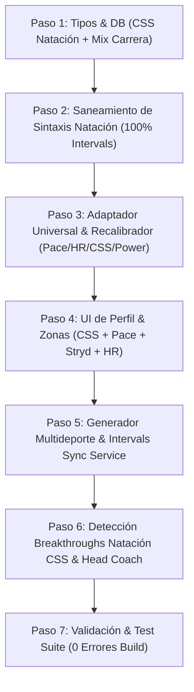

# 📋 PLAN MAESTRO INTEGRAL DE EJECUCIÓN: Motor Multideporte de Workouts (Running Dual Mix, Natación CSS 100% Intervals Compliant, Breakthroughs y Recalibración Reactiva) — SGEA v3.83

> [!IMPORTANT]
> **ESTADO DEL PLAN: EN REVISIÓN (PENDIENTE DE APROBACIÓN EXPLÍCITA).**
> **REGLA DE BLOQUEO:** Ningún cambio de código o comando destructivo se ejecutará hasta recibir la confirmación y el "OK" formal del usuario.

---

## 🧭 1. CONTEXTO, AVANCES PREVIOS (CONVERSACIÓN "Plan de Ritmo/HR") Y NUEVAS NECESIDADES

### 🏆 1.1. Logros Consolidados y Verificados en el Repositorio (v3.83 - Commits `35cca19`, `ff0e2db`, `8183bff`, `32bda71`, `58ef03a`):
1. **Rediseño UX Modular de Perfil en 4 Pestañas (`AthletePhysiologyView.tsx`):**
   - Consolidación limpia sin interfaces duplicadas:
     * **Pestaña 1 (`AthleteZonesTab.tsx`):** Zonas & Umbrales (Potencia de Carrera, Ritmo Umbral, FC LTHR y Ciclismo FTP con tarjetas de calibración/breakthroughs interactivas).
     * **Pestaña 2 (`AthleteBioProfileTab.tsx`):** Perfil & Biometría (peso, altura, fecha de nacimiento, sexo, FC reposo, FC máx, selector de modo de carrera).
     * **Pestaña 3 (`AthleteAvailabilityTab.tsx`):** Matriz de disponibilidad semanal.
     * **Pestaña 4 (`AthleteIntervalsTab.tsx`):** Conexión dedicada a Intervals.icu (credenciales, Athlete ID, estado en vivo y sincronización).
   - Eliminación de dobles iconos, textos azules obsoletos y redundancias en tarjetas secundarias.
   - Generalización de la métrica: *"Potencia de Carrera (Running Power)"*, compatible con podómetro Stryd y potencia nativa de muñeca Garmin.
2. **Motor Universal de Detección de Breakthroughs (`BreakthroughDetectionService.ts`):**
   - Detección de picos de rendimiento no solo en tests formales, sino en cualquier sesión real de carrera (potencia y ritmo) y ciclismo (eFTP).
   - **Compuerta de Carga Interna Fisiológica para Ritmo:** Solo detecta mejoras de ritmo si $\text{avgHR} \ge 88\% \text{ LTHR}$ o $\ge 82\% \text{ FC Máxima}$, erradicando falsos positivos por viento a favor o bajadas de GPS.
3. **Recalibración Dinámica Reactiva de Vatios (`WorkoutDetailModal.tsx` & `WorkoutChart.tsx`):**
   - Limpieza automática de vatios hardcodeados antiguos en descripciones estructuradas y recalibración en vivo de rangos (ej. `88-92% CP (308-322W)`).
   - Sincronización automática de nuevos umbrales a Intervals.icu (`POST /api/sync-settings`) para actualizar `sportSettings`.

---

### ⚠️ 1.2. Nuevos Cuellos de Botella Detectados para Resolver:
1. **Natación (Bug de 10 Horas y Ausencia de CSS):**
   - **Causa Raíz:** Las plantillas de natación (`swimWorkoutsBaseBuild.ts`, `swimWorkoutsPeakTaper.ts`) poseen sintaxis coloquial no estándar (`50m - 100m - 150m...`, `c/15s`, `(Punto muerto / 1 brazo)`). Al sincronizar con Intervals.icu, el parser se desborda y calcula hasta **10 horas** de duración.
   - **Dato Faltante:** En el perfil del atleta no existe la métrica **CSS (Critical Swim Speed / Ritmo Umbral en seg/100m y min/100m)**, impidiendo a Intervals.icu y a Pulse calcular tiempos y zonas acuáticas reales.
2. **Carrera a Pie (Mix Inteligente Distancia vs. Tiempo):**
   - La regla rígida de prescribir únicamente por tiempo limitaba la efectividad en:
     * **Series fraccionadas de pista y repeticiones:** $200\text{m}$, $400\text{m}$, $800\text{m}$, $1.000\text{m}$, $2.000\text{m}$ (donde el corredor necesita referencias métricas de cronómetro).
     * **Tests de Control Fisiológico:** $\text{Test 5K}$, $\text{Test 3K}$, $\text{Test 1K / Cooper}$ (distancia fija para medir progreso temporal).
     * **Fondos Largos y Rodajes Z2:** Mantener **Tiempo** (ej. 45m, 1h30m) para blindar el control de carga sin sobrecargas por kilometraje.

---

## 🎯 2. MATRIZ DE PRESCRIPCIÓN MULTIDEPORTE DEFINITIVA

```
                                  EVALUACIÓN DEL ATLETA POR DISCIPLINA
                                                    │
             ┌──────────────────┬───────────────────┴───────────────────┬──────────────────┐
             ▼                  ▼                                       ▼                  ▼
        🏊 NATACIÓN        🏃 CARRERA (STRYD / HÍBRIDO)            🚴 CICLISMO        🏋️ FUERZA
      • Métrica: CSS     • Stryd: % CP (Vatios)                  • Métrica: % FTP   • Circuitos por Fases
      • Bloques limpios  • Híbrido: % Pace (Series) / % LTHR     • Cadencia (RPM)   • Rondas / Reps / RPE
      • Sintaxis oficial • Mix: Distancia en series, Tiempo Z2   • Tests de 20m     • Rotación Coprima
```

| Disciplina | Tipología de Sesión | Unidad Principal | Métrica Rector en Tarjeta UI | Sintaxis en Intervals.icu |
| :--- | :--- | :--- | :--- | :--- |
| **Natación** | Técnica / Base / CSS / Velocidad | Distancia (Metros) | Metros + Tiempo Estimado (según CSS) | `Warmup`<br>`- 300m 60% Pace`<br>`Main`<br>`- 6x`<br>`  - 100m 100% Pace`<br>`  - 15s recovery`<br>`Cooldown`<br>`- 150m 50% Pace` |
| **Carrera (Stryd)** | Series de Pista / Calidad | Distancia (m) o Tiempo | Vatios (`275W • 98% CP`) | `- 8x 400m 98% FTP`<br>`  - 60s recovery` |
| **Carrera (Stryd)** | Fondos / Rodajes Z2 | Tiempo (min/h) | Vatios (`200W • 75% CP`) | `- 1h15m 75% FTP` |
| **Carrera (Híbrido)**| Series de Pista / Calidad | Distancia (m) o Tiempo | Ritmo (`4:05/km • 105% Pace`) | `- 6x 1000m 105% Pace`<br>`  - 90s recovery` |
| **Carrera (Híbrido)**| Fondos / Rodajes Z2 | Tiempo (min/h) | Pulso (`142 bpm • 82% LTHR`) | `- 1h20m 82% LTHR` |
| **Carrera (Ambos)** | Test de Control (5K / 3K) | Distancia Fija | Ritmo libre / Max Esfuerzo | `- 5000m Max Effort (Test 5K)` |
| **Ciclismo** | Rodajes, SweetSpot, VO2max | Tiempo (min/h) | Vatios (`220W • 88% FTP`) | `- 3x 12m 90% FTP` |
| **Fuerza** | Estructural, Máxima, Potencia | Ejercicios / Series | Minutos + Ejercicios + RPE | `Warmup`<br>`- 5m Movilidad`<br>`Main (3 Rondas)`<br>`- 10x Sentadillas búlgaras` |

---

## 🛠️ 3. PLAN DE ACCIÓN PASO A PASO (PARA FUTURA EJECUCIÓN)



---

### 🔹 PASO 1: Tipos, Modelo de Datos & SSOT
**Archivos:**
- `src/lib/db/types.ts`
- `src/lib/intervals/types.ts`
- `src/lib/validation/schemas.ts`

**Acciones Concretas:**
1. Agregar soporte de **Natación CSS** a `AthleteProfile` y `UserProfileData`:
   - `swimCssSecPer100m?: number;` (segundos por 100m, ej. `105` = 1:45/100m)
   - `swimCssStr?: string;` (formato texto, ej. `"1:45"`)
2. Consolidar campos de carrera con soporte mixto de distancia/tiempo y potencia/híbrido.
3. Actualizar validación de esquemas Zod en `schemas.ts`.

---

### 🔹 PASO 2: Saneamiento Total de Natación (`workoutDoc` 100% Intervals Compliant)
**Archivos:**
- `src/lib/physiology/swimWorkoutsBaseBuild.ts`
- `src/lib/physiology/swimWorkoutsPeakTaper.ts`
- `src/lib/physiology/swimWorkoutPool.ts`

**Acciones Concretas:**
1. Erradicar de raíz toda sintaxis informal en descripciones de nado:
   - Reemplazar guiones múltiples (`50m - 100m - 150m...`) por bloques escalonados individuales.
   - Reemplazar `c/15s`, `c/20s` o `c/2m desc` por `- 15s recovery` o `- 20s rest`.
   - Reemplazar textos informales dentro de series (`(Punto muerto / 1 brazo)`) por estructura `Main / 6x / - 50m Drill / - 15s recovery`.
2. Garantizar que la suma de pasos del entrenamiento resulte matemáticamente en la duración real de la sesión (40-55 min), eliminando el desborde a 10 horas en Intervals.icu.

---

### 🔹 PASO 3: Adaptador Fisiológico Universal y Motor de Recalibración
**Archivos:**
- `src/lib/physiology/runningWorkoutAdapter.ts`
- `src/lib/physiology/macrocycleTemplateHelpers.ts`

**Acciones Concretas:**
1. Extender `interpolateWorkoutTarget(rawTarget, opts)` para dar soporte a:
   - **Potencia Carrera / Ciclismo:** Interpolación dinámica de W y % CP / % FTP.
   - **Híbrido Carrera:** Interpolación dinámica de `min/km (% Pace)` en series y `bpm (% LTHR)` en fondos.
   - **Natación CSS:** Interpolación de ritmos por 100m y cálculo de tiempo estimado según el CSS del atleta.
   - **Series por Distancia:** Soporte para targets métricos (`200m`, `400m`, `800m`, `1000m`, `5000m Test`).

---

### 🔹 PASO 4: Zonas en Perfil & Reactividad UI
**Archivos:**
- `src/components/profile/AthleteZonesTab.tsx`
- `src/components/profile/AthleteBioProfileTab.tsx`
- `src/components/profile/AthleteZonesViewer.tsx`
- `src/components/WorkoutChart.tsx`
- `src/components/modals/WorkoutDetailModal.tsx`

**Acciones Concretas:**
1. **Natación CSS en Zonas & Perfil:**
   - Incorporar la tarjeta de **Ritmo Umbral de Natación (CSS - min/100m)** en `AthleteZonesTab.tsx`.
   - Incorporar visualizador de las 5 Zonas Acuáticas (Z1 Aeróbico Suave a Z5 Sprint de Velocidad).
   - Permitir editar el CSS directamente desde `AthleteBioProfileTab.tsx` o `AthleteZonesTab.tsx`.
2. **Visualización Reactiva en `WorkoutChart.tsx`:**
   - Soporte para pasos de distancia en natación y series de running, mostrando ritmos calculados y descansos claros en el gráfico.

---

### 🔹 PASO 5: Generador Multideporte & Intervals Sync Service
**Archivos:**
- `src/lib/gemini/deterministicPlanGenerator.ts`
- `src/lib/physiology/macrocycleTemplates.ts`
- `src/lib/services/intervalsSyncService.ts`
- `src/lib/intervals/client.ts`

**Acciones Concretas:**
1. En `intervalsSyncService.ts`: Despachar las descripciones de natación saneadas con `type: "Swim"` y descansos reconocibles por el parser de Intervals.icu.
2. En `client.ts`: Extraer automáticamente `threshold_pace` del `sportSettings` de tipo `"Swim"` al autenticarse o sincronizar con Intervals.icu.

---

### 🔹 PASO 6: Detección de Breakthroughs en Natación CSS & Head Coach
**Archivos:**
- `src/lib/physiology/BreakthroughDetectionService.ts`
- `src/lib/physiology/SwimCssDetectionService.ts` (nuevo módulo atómico < 150 LOC)
- `src/lib/ai/prompts.ts`
- `src/lib/ai/headcoach/chatContext.ts`

**Acciones Concretas:**
1. Crear `SwimCssDetectionService.ts` para detectar mejoras en el ritmo CSS a partir de actividades de natación en piscina (ej. tests 400m/200m o series continuas a ritmo alto).
2. Conectar el detector al orquestador `BreakthroughDetectionService.ts` para generar tarjetas de calibración de CSS en `AthleteZonesTab.tsx`.
3. Inyectar el CSS del atleta en la memoria y prompt del Head Coach IA.

---

### 🔹 PASO 7: Set de Pruebas & Verificación Obligatoria
1. **Tipado Estricto:** `npx tsc --noEmit` (Código 0).
2. **Build de Producción:** `npm run build` (Código 0).
3. **Auditoría de Invarianza Stryd/Ciclismo:** Cero regresiones en atletas de potencia.
4. **Auditoría de Natación Intervals:** Verificación de que los eventos de natación sincronizan con tiempo exacto (ej. 45-50 min) y cero desbordes a 10 horas.
5. **Auditoría de Modularidad:** Todos los archivos modificados o creados estrictamente $< 350$ LOC.

---

## 🛑 4. ESPERA DE CONFIRMACIÓN

El plan maestro se encuentra completamente actualizado y alineado con los últimos cambios y la documentación del sistema.
**A la espera de tu aprobación explícita ("Procede" / "OK") para iniciar la ejecución del Paso 1.**
