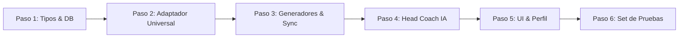

# 📋 PLAN MAESTRO DE EJECUCIÓN: Running Multimodal (Potencia • Híbrido • Ritmo • Pulso) — SGEA v3.80

> **OBJETIVO DIRECTO:**
> 1. Si el atleta tiene Stryd: **Entrena 100% por Potencia (Vatios / % CP)**. El código y flujo actual se mantiene **intacto e idéntico**.
> 2. Si el atleta NO tiene Stryd: Entrena en **Modo Híbrido (Series por Ritmo `min/km` + Fondos por Pulso `bpm`)**, con opción de elegir Solo Ritmo o Solo Pulso.
> 3. Los 18 modelos existentes **no se duplican**. Un adaptador ligero traduce la carrera al vuelo según la métrica del atleta.

---

## 🎯 REGLAS DE ORO DEL PLAN (CERO CONFUSIÓN)

1. **Invarianza de Potencia:** Un atleta con `runFtp > 0` o checkbox de Stryd activo no nota ningún cambio. Sus vatios, entrenamientos y sincronización a Intervals.icu son 100% idénticos a v3.79.
2. **Ciclismo y Fuerza:** Ciclismo sigue siempre por vatios (`% FTP`) y fuerza por rutinas funcionales (`WeightTraining`).
3. **Estándar para Atletas sin Stryd:** El sistema les asigna automáticamente el **Modo Híbrido** (la mejor práctica deportiva):
   - **Series y Calidad:** Manda el **Ritmo** (`% Pace` en Intervals / `min/km` en tarjeta).
   - **Fondos y Rodajes Suaves:** Manda el **Pulso** (`% LTHR` en Intervals / `bpm` en tarjeta).

---

## 🛠️ PASO A PASO DE IMPLEMENTACIÓN



---

### PASO 1: Tipos y Modelo de Datos (SSOT)
**Archivos a modificar:**
- `src/lib/db/types.ts`
- `src/lib/intervals/types.ts`
- `src/lib/validation/schemas.ts`

**Acciones concretas:**
1. Crear el tipo de unión:
   ```typescript
   export type RunningTrainingMode = "POWER" | "HYBRID" | "PACE" | "HEART_RATE";
   ```
2. Agregar a `UserProfileData` y `AthleteProfile`:
   - `hasRunningPowerMeter?: boolean;` (checkbox de Stryd)
   - `runningTrainingMode?: RunningTrainingMode;` (modalidad)
   - `runThresholdPaceSecPerKm?: number;` (ritmo umbral en segundos, ej. 270s = 4:30/km)
   - `runThresholdPaceStr?: string;` (ritmo umbral legible, ej. "4:30")
3. Agregar a Zod en `schemas.ts` para permitir validación en las APIs.

---

### PASO 2: Adaptador Fisiológico Universal (El Puente)
**Archivo nuevo a crear:**
- `src/lib/physiology/runningWorkoutAdapter.ts` (< 180 LOC)

**Acciones concretas:**
1. Crear función `resolveRunningMode(profile)`:
   - Si `hasRunningPowerMeter === true` o `runFtp > 0` -> Retorna `"POWER"`.
   - Si tiene valor explícito (`"HYBRID"`, `"PACE"`, `"HEART_RATE"`) -> Lo retorna.
   - Si no está configurado y no tiene Stryd -> Retorna `"HYBRID"`.
2. Crear función `adaptRunningWorkoutDoc(workoutDoc, discipline, isQuality, mode)`:
   - Si `discipline !== "Carrera"` o `mode === "POWER"` -> Retorna el texto intacto (con `% FTP`).
   - Si `mode === "HYBRID"` -> Reemplaza `% FTP` por `% Pace` si es calidad, o por `% LTHR` si es fondo/suave.
   - Si `mode === "PACE"` -> Reemplaza `% FTP` por `% Pace`.
   - Si `mode === "HEART_RATE"` -> Reemplaza `% FTP` por `% LTHR`.
3. Crear función `formatIntensityTarget(params)`:
   - Si es Potencia o Ciclismo -> `240W (80% CP)` o `180W (70% FTP)`.
   - Si es Ritmo -> `4:45/km (80% Pace)`.
   - Si es Pulso -> `145 bpm (80% LTHR)`.

---

### PASO 3: Generadores de Planes, Macrociclos y Sincronización
**Archivos a modificar:**
- `src/lib/gemini/deterministicPlanGenerator.ts`
- `src/lib/ai/knowledge/longRunPeriodization.ts`
- `src/lib/ai/knowledge/index.ts`
- `src/lib/services/intervalsSyncService.ts`

**Acciones concretas:**
1. En `deterministicPlanGenerator.ts`:
   - Resolver `runningMode = resolveRunningMode(profile)`.
   - En sesiones de carrera, aplicar `adaptRunningWorkoutDoc` al `workoutDoc` y `formatIntensityTarget` al `powerTarget`.
   - En ciclismo: mantener 100% vatios y `% FTP`.
2. En `longRunPeriodization.ts` y tiradas largas:
   - Si es modo `POWER`: vatios y `% CP` (idéntico a hoy).
   - Si es `HYBRID` o `HEART_RATE`: pulso en `bpm` y `% LTHR`.
   - Si es `PACE`: ritmo en `min/km` y `% Pace`.
3. En `intervalsSyncService.ts`:
   - Despachar el `workoutDoc` adaptado (`% FTP`, `% Pace` o `% LTHR`) para que el reloj del corredor (Garmin/Coros) cargue las alertas de zona exactas.

---

### PASO 4: Agente Head Coach & Prompts
**Archivos a modificar:**
- `src/lib/ai/prompts.ts`
- `src/lib/ai/headcoach/chatContext.ts`
- `src/lib/ai/defaultPrompts.ts`

**Acciones concretas:**
1. En `chatContext.ts`, resolver el `runningMode` del atleta y pasarlo al contexto del prompt.
2. En `prompts.ts` (`buildHeadCoachSystemPrompt`), inyectar la instrucción unívoca:
   - Si es `POWER`: Hablar exclusivamente de vatios Stryd (% CP).
   - Si es `HYBRID`: Hablar de ritmo en series e intervalos, y de pulso/FC en rodajes suaves y fondos.
   - Si es `PACE`: Hablar exclusivamente de ritmo (min/km).
   - Si es `HEART_RATE`: Hablar exclusivamente de pulso y zonas cardíacas.

---

### PASO 5: Interfaz de Usuario y Ergonomía del Perfil
**Archivos a modificar:**
- `src/components/profile/AthleteEditProfileModal.tsx`
- `src/components/profile/ProfilePhysiologyTab.tsx`
- `src/components/profile/AthleteProfileHeroCard.tsx`
- `src/components/profile/AthleteZonesViewer.tsx`
- `src/components/WorkoutChart.tsx`
- `src/components/dashboard/AthleteCalendarDayTile.tsx`
- `src/components/dashboard/AthleteMobileWorkoutCard.tsx`

**Acciones concretas:**
1. **Modal de Edición y Pestaña de Fisiología:**
   - Checkbox: `[x] Entreno con Potenciómetro de Carrera (Stryd)`.
   - Si está marcado: muestra input de Stryd CP (vatios).
   - Si está desmarcado: muestra selector con 3 opciones:
     - `(●) Híbrido: Ritmo en Series + Pulso en Fondos (Recomendado)`
     - `( ) Solo Ritmo (min/km)`
     - `( ) Solo Frecuencia Cardíaca (bpm)`
     - Inputs para calibrar Ritmo Umbral (`min/km`) y LTHR (`bpm`).
2. **Tarjeta de Cabecera del Atleta (`AthleteProfileHeroCard.tsx`):**
   - Mostrar badge con la modalidad activa:
     - ⚡ `Potencia Stryd (${runFtp}W)`
     - ⏱️❤️ `Híbrido (${paceStr}/km • ${lthr} bpm)`
     - ⏱️ `Solo Ritmo (${paceStr}/km)`
     - ❤️ `Solo Pulso (${lthr} bpm)`
3. **Gráfico de Entrenamientos (`WorkoutChart.tsx`):**
   - El tooltip muestra `245W` si es potencia, `148 bpm` si es pulso, o `4:50/km` si es ritmo.
4. **Visor de Zonas (`AthleteZonesViewer.tsx`):**
   - Añadir tabla de Zonas de Ritmo (Z1-Z5 Daniels/Pace) con badge `[ACTIVA]` en la modalidad del atleta.
5. **Tarjetas de Calendario:**
   - Mostrar icono dinámico: ⚡ para vatios, ⏱️ para ritmo, ❤️ para pulso.

---

### PASO 6: Set de Pruebas & Validación Obligatoria
1. **Verificación de Tipado:** `./node_modules/.bin/tsc --noEmit` (Código 0).
2. **Compilación de Producción:** `npm run build` (Código 0).
3. **Auditoría de Invarianza Stryd:** Verificar que un atleta con Stryd no sufre ninguna modificación de vatios ni sintaxis.
4. **Auditoría de Atleta sin Stryd:** Verificar que un atleta en modo Híbrido tiene series por ritmo y fondos por pulso.

---

## 🚀 CONFIRMACIÓN PARA EJECUTAR

Este plan es directo, quirúrgico y no altera ningún modelo científico existente. Si estás de acuerdo, responde **"Procede"** o pulsa **Proceed** y arrancamos inmediatamente con el **Paso 1**.
